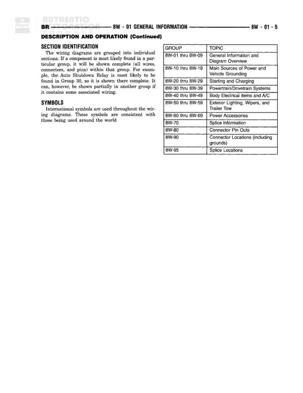

# GENERAL INFORMATION - DESCRIPTION AND OPERATION (Continued) - CIRCUIT INFORMATION

**Notes:** This page contains reference information explaining wire code identification system and circuit functions. It shows how to read wire labels (e.g., A 2 18 LB/YL = Battery Feed circuit, part 2, 18 gauge, Light Blue with Yellow tracer). Includes complete color code table and circuit function codes A-Z. Standard tracer color is WT (White) except for GY, LB, LG, OR, PK, WT, and YL which use BK (Black) tracer, with PK using either BK or WT.
