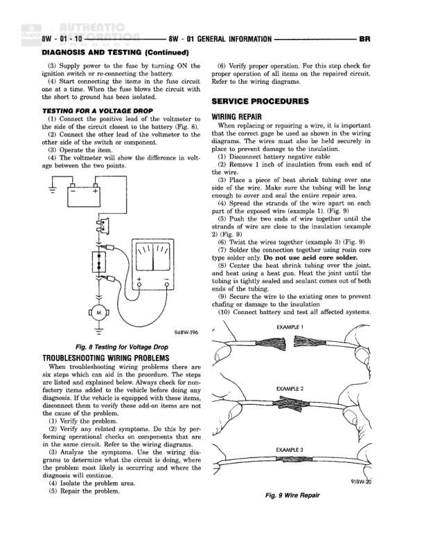

# General Information - Section Identification and Symbols

**Notes:** This page provides reference information for understanding the wiring diagram organization. It contains a section identification table showing how wiring diagrams are grouped by topic (8W-01 through 8W-95), and notes that international symbols consistent with those used worldwide are employed throughout the diagrams.
