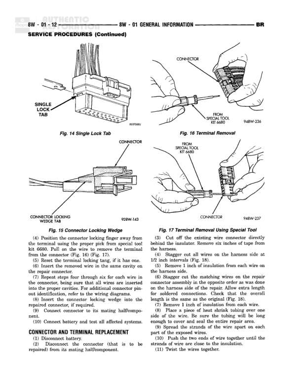

# GENERAL INFORMATION - DESCRIPTION AND OPERATION (Continued)

**Notes:** This page contains general information about connector identification, splice locations, and safety warnings. Not a wiring diagram page with actual circuit connections.

## Cross-References

- 8W-80
- 8W-70
- 8W-90
