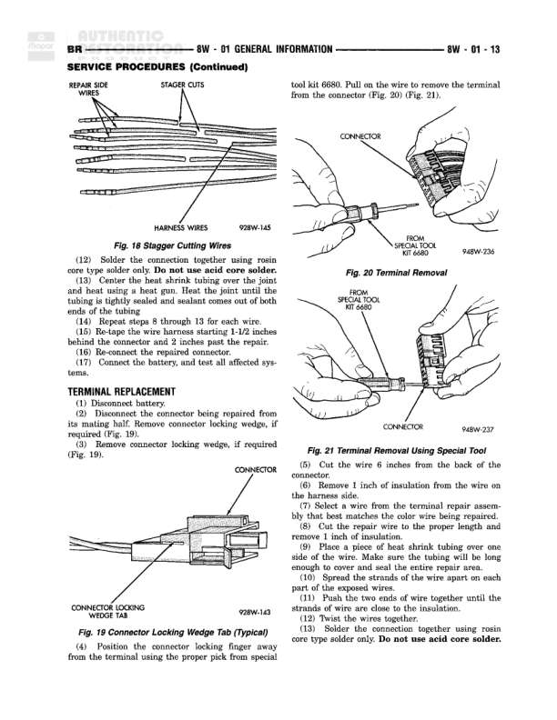

# DIAGNOSIS AND TESTING (Continued)

**Notes:** This page contains diagnostic procedures and testing instructions rather than a wiring diagram. It includes: Fig. 5 Probing Tool illustration (9ABW-233), Fig. 6 Testing for Voltage Potential diagram (9ABW-194), and Fig. 7 Testing for Continuity diagram (9ABW-195). The page provides troubleshooting guidance including: testing for voltage potential using a voltmeter connected to ground, testing for continuity by checking circuit resistance with battery disconnected, and testing for shorts to ground by removing fuses and checking wiring harness sections. Instructions emphasize keeping terminals clean and free of corrosion/dirt, proper wire insulation inspection, and systematic circuit testing procedures.
