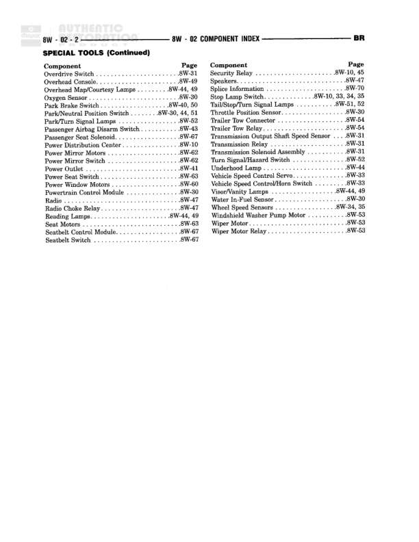

# Component Index (Continued)

**Notes:** This is a component index page (continued from 8W-02-1) that lists components alphabetically with their corresponding diagram page references. This is not a wiring diagram but rather a reference guide to locate components within the service manual.

## Components

| Component | Ref | Connectors | Notes |
|-----------|-----|------------|-------|
| Operating Switch | 8W-31 |  | Component index reference |
| Overhead Console | 8W-49 |  | Component index reference |
| Overhead Map/Courtesy Lamps | 8W-44, 49 |  | Component index reference |
| Oxygen Sensor | 8W-30 |  | Component index reference |
| Park Brake Switch | 8W-40, 50 |  | Component index reference |
| Park/Neutral Switch | 8W-40, 50 |  | Component index reference |
| Park/Turn Signal Lamps | 8W-52 |  | Component index reference |
| Passenger Airbag Disable Switch | 8W-43 |  | Component index reference |
| Passenger Seat Solenoid | 8W-67 |  | Component index reference |
| Power Distribution Center | 8W-10 |  | Component index reference |
| Power Door Lock Motors | 8W-68 |  | Component index reference |
| Power Mirror Switch | 8W-62 |  | Component index reference |
| Power Outlets | 8W-41 |  | Component index reference |
| Power Seat Switch | 8W-63 |  | Component index reference |
| Power Window Motors | 8W-60 |  | Component index reference |
| Powertrain Control Module | 8W-30 |  | Component index reference |
| Radio | 8W-47 |  | Component index reference |
| Radio Choke Relay | 8W-47 |  | Component index reference |
| Reading Lamps | 8W-44, 49 |  | Component index reference |
| Seat Motors | 8W-63 |  | Component index reference |
| Seatbelt Control Module | 8W-67 |  | Component index reference |
| Seatbelt Switch | 8W-67 |  | Component index reference |
| Security Relay | 8W-10, 45 |  | Component index reference |
| Speakers | 8W-47 |  | Component index reference |
| Splice Information | 8W-70 |  | Component index reference |
| Stop Lamp Switch | 8W-10, 30, 34, 35 |  | Component index reference |
| Taillamps/Turn Signal Lamps | 8W-31, 52 |  | Component index reference |
| Theft Deterrent Module | 8W-45 |  | Component index reference |
| Trailer Tow Connector | 8W-54 |  | Component index reference |
| Trailer Tow Relay | 8W-54 |  | Component index reference |
| Transmission Output Shaft Speed Sensor | 8W-31 |  | Component index reference |
| Transmission Relay | 8W-31 |  | Component index reference |
| Transmission Temperature Sensor | 8W-31 |  | Component index reference |
| Turn Signal/Hazard Switch | 8W-52 |  | Component index reference |
| Underhood Lamp | 8W-44 |  | Component index reference |
| Vehicle Speed Control Servo | 8W-33 |  | Component index reference |
| Vehicle Speed Control/Horn Switch | 8W-33 |  | Component index reference |
| Washer Fluid Level Sensor | 8W-53 |  | Component index reference |
| Water In Fuel Sensor | 8W-30 |  | Component index reference |
| Wheel Speed Sensors | 8W-34, 35 |  | Component index reference |
| Windshield Washer Pump Motor | 8W-53 |  | Component index reference |
| Wiper Motor | 8W-53 |  | Component index reference |
| Wiper Motor Relay | 8W-53 |  | Component index reference |

## Cross-References

- 8W-10
- 8W-30
- 8W-31
- 8W-33
- 8W-34
- 8W-35
- 8W-40
- 8W-41
- 8W-43
- 8W-44
- 8W-45
- 8W-47
- 8W-49
- 8W-50
- 8W-52
- 8W-53
- 8W-54
- 8W-60
- 8W-62
- 8W-63
- 8W-67
- 8W-68
- 8W-70
