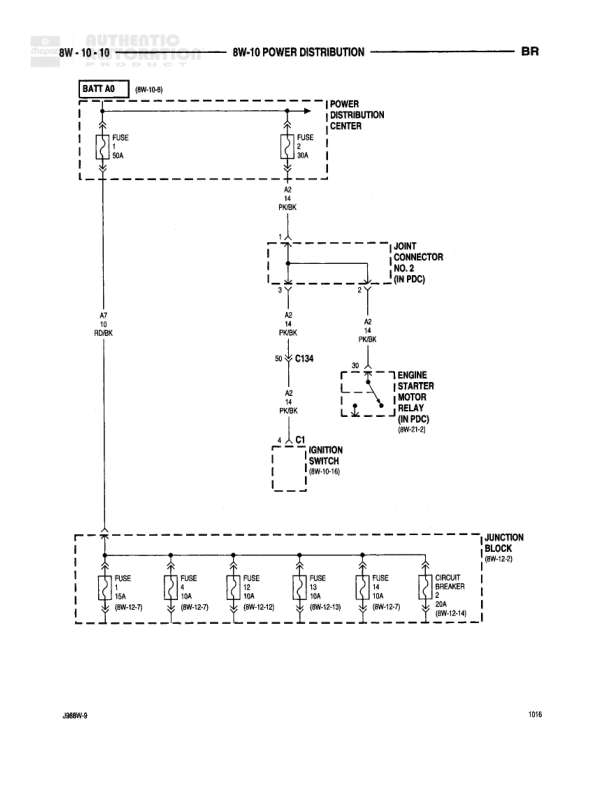

# POWER DISTRIBUTION

**Notes:** This diagram shows the main power distribution from the battery through the Power Distribution Center to various systems including the ignition switch and starter motor relay. Multiple fuses protect different circuits in the junction block.

## Components

| Component | Ref | Connectors | Notes |
|-----------|-----|------------|-------|
| Battery | BATT A0 |  | Located at 8W-10-0 |
| Power Distribution Center | POWER DISTRIBUTION CENTER |  | Contains FUSE 2 (50A) |
| Joint Connector No. 2 | JOINT CONNECTOR NO. 2 (IN PDC) |  | Located in Power Distribution Center |
| Engine Starter Motor Relay | ENGINE STARTER MOTOR RELAY (IN PDC) |  | 8W-21-1, Located in Power Distribution Center |
| Ignition Switch | IGNITION SWITCH | C1 | 8W-10-10 |
| Junction Block | JUNCTION BLOCK |  | 8W-10-0, Contains multiple fuses |

## Wires

| From | To | Wire Code | Gauge | Color | Notes |
|------|-----|-----------|-------|-------|-------|
| BATT A0 | FUSE 1 (30A) | A2 | 10 | RD/BK | From 8W-10-0 |
| FUSE 1 (30A) | FUSE 2 (50A) in PDC | A2 | None | PK/BK | None |
| FUSE 2 (50A) | Joint Connector No. 2 | A2 | 10 | PK/BK | None |
| Joint Connector No. 2 | Engine Starter Motor Relay S0 | A2 | 10 | PK/BK | None |
| Joint Connector No. 2 | Ignition Switch C1 | A2 | 10 | PK/BK | None |
| Engine Starter Motor Relay | C134 | A0 | 10 | PK/BK | S0 connection |
| Ignition Switch | Junction Block | A2 | 10 | PK/BK | Multiple fuse connections |

## Splices & Grounds

| ID | Type | Location | Wires Connected | Notes |
|----|------|----------|-----------------|-------|
| C134 | connector | Between Engine Starter Motor Relay and power distribution | A0 | In-line connector |
| C1 | connector | Ignition Switch | A2 | Ignition switch connector |

## Cross-References

- 8W-10-0
- 8W-21-1
- 8W-10-10
