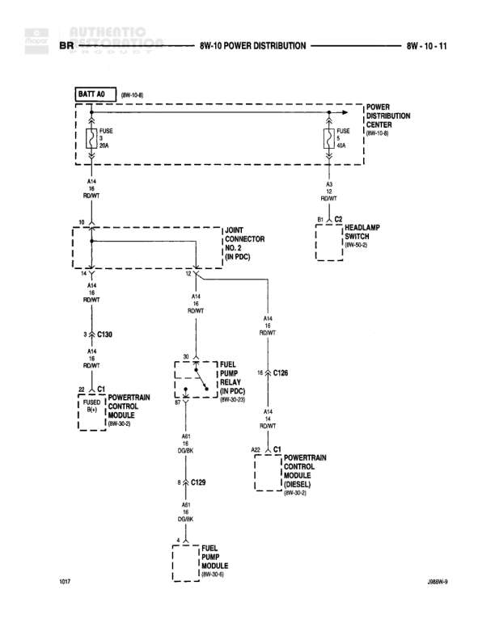

# POWER DISTRIBUTION

**Notes:** Diagram shows power distribution from battery through PDC to various modules including headlamp switch, fuel pump relay, and powertrain control modules for both diesel and gasoline variants. U017 and 268KW-9 appear at bottom corners as reference marks.

## Components

| Component | Ref | Connectors | Notes |
|-----------|-----|------------|-------|
| BATT A0 | 8W-10-6 |  | Battery connection point |
| POWER DISTRIBUTION CENTER | 8W-10-1 |  | Main power distribution |
| HEADLAMP SWITCH | 8W-40-3 |  |  |
| JOINT CONNECTOR NO. 2 | IN PDC |  | Located in Power Distribution Center |
| FUEL PUMP RELAY | IN PDC, 8W-20-21 |  | Located in Power Distribution Center |
| POWERTRAIN CONTROL MODULE | 8W-30-3 | C1 | Diesel |
| POWERTRAIN CONTROL MODULE | 8W-30-2 | C1 | Gasoline |
| FUEL PUMP MODULE | 8W-10-6 |  |  |

## Wires

| From | To | Wire Code | Gauge | Color | Notes |
|------|-----|-----------|-------|-------|-------|
| BATT A0 | FUSE 1 (30A) | A4 | 10 | RD/WT |  |
| FUSE 1 (30A) | A4 RD/WT | A4 | 10 | RD/WT |  |
| POWER DISTRIBUTION CENTER | FUSE 1 (30A) | A4 | 10 | RD/WT |  |
| A4 RD/WT | HEADLAMP SWITCH | A4 | 10 | RD/WT | B1 and C2 connections |
| A4 RD/WT | JOINT CONNECTOR NO. 2 | A4 | 10 | RD/WT | 12 connection |
| A4 RD/WT | C130 | A4 | 14 | RD/WT | Continues to 3 2 |
| C130 | POWERTRAIN CONTROL MODULE C1 | A4 | 14 | RD/WT | Diesel, connects to pin 2 |
| JOINT CONNECTOR NO. 2 | FUEL PUMP RELAY | A4 | 14 | RD/WT | 30 connection |
| FUEL PUMP RELAY | C126 | A4 | 14 | RD/WT | 87 connection, continues to 11 9 |
| C126 | POWERTRAIN CONTROL MODULE C1 | A20 | None | None | Gasoline, connects to pin 1 |
| FUEL PUMP RELAY | C129 | A61 | 8 | DG/BK | 85 connection, continues to 6 2 |
| C129 | FUEL PUMP MODULE | A61 | 8 | DG/BK |  |
| FUEL PUMP RELAY | Ground | A61 | None | DG/BK | 86 connection |

## Cross-References

- 8W-10-6
- 8W-10-1
- 8W-40-3
- 8W-30-3
- 8W-30-2
- 8W-20-21
