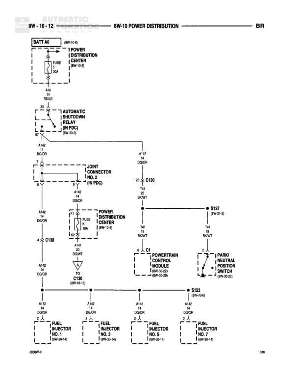

# POWER DISTRIBUTION

**Notes:** This diagram shows the power distribution from battery through the automatic shutdown relay to various fuel injectors and powertrain control module. Ground distribution also shown through splice S127.

## Components

| Component | Ref | Connectors | Notes |
|-----------|-----|------------|-------|
| BATT A0 | 8W-10-8 |  | Battery feed |
| POWER DISTRIBUTION CENTER | 8W-10-8 |  | PDC |
| AUTOMATIC SHUTDOWN RELAY (IN PDC) | 8W-30-3 |  |  |
| JOINT CONNECTOR NO. 1 (IN PDC) |  |  |  |
| POWER DISTRIBUTION CENTER | 8W-10-8 |  | Second instance |
| POWERTRAIN CONTROL MODULE | 8W-30-22, 8W-30-69 | C1 |  |
| PARK/NEUTRAL POSITION SWITCH | 8W-30-22 |  |  |
| FUEL INJECTOR NO. 1 | 8W-30-14 |  |  |
| FUEL INJECTOR NO. 3 | 8W-30-14 |  |  |
| FUEL INJECTOR NO. 5 | 8W-30-14 |  |  |
| FUEL INJECTOR NO. 7 | 8W-30-14 |  |  |

## Wires

| From | To | Wire Code | Gauge | Color | Notes |
|------|-----|-----------|-------|-------|-------|
| BATT A0 | POWER DISTRIBUTION CENTER | A4 | 6 | RD |  |
| POWER DISTRIBUTION CENTER | AUTOMATIC SHUTDOWN RELAY | A142 | 12 | DG/OR |  |
| AUTOMATIC SHUTDOWN RELAY | JOINT CONNECTOR NO. 1 | A142 | 12 | DG/OR |  |
| JOINT CONNECTOR NO. 1 | C130 | A142 | 18 | DG/OR |  |
| JOINT CONNECTOR NO. 1 | POWER DISTRIBUTION CENTER | Z1 | 14 | BK/WT |  |
| POWER DISTRIBUTION CENTER | S127 | Z1 | 14 | BK/WT |  |
| S127 | POWERTRAIN CONTROL MODULE C1 | Z1 | 14 | BK/WT |  |
| S127 | PARK/NEUTRAL POSITION SWITCH | Z1 | 14 | BK/WT |  |
| POWER DISTRIBUTION CENTER | C130 | A141 | 20 | DG/WT |  |
| C130 | S123 | A142 | 18 | DG/OR |  |
| S123 | FUEL INJECTOR NO. 1 | A142 | 18 | DG/OR |  |
| S123 | FUEL INJECTOR NO. 3 | A142 | 18 | DG/OR |  |
| S123 | FUEL INJECTOR NO. 5 | A142 | 18 | DG/OR |  |
| S123 | FUEL INJECTOR NO. 7 | A142 | 18 | DG/OR |  |

## Splices & Grounds

| ID | Type | Location | Wires Connected | Notes |
|----|------|----------|-----------------|-------|
| C130 | connector | In-line connector | A142, A141 |  |
| S127 | splice | Power distribution area | Z1 | 8W-30-3 |
| S123 | splice | Fuel injector distribution | A142 | 8W-30-6 |

## Cross-References

- 8W-10-8
- 8W-30-3
- 8W-30-22
- 8W-30-69
- 8W-30-14
- 8W-30-6
