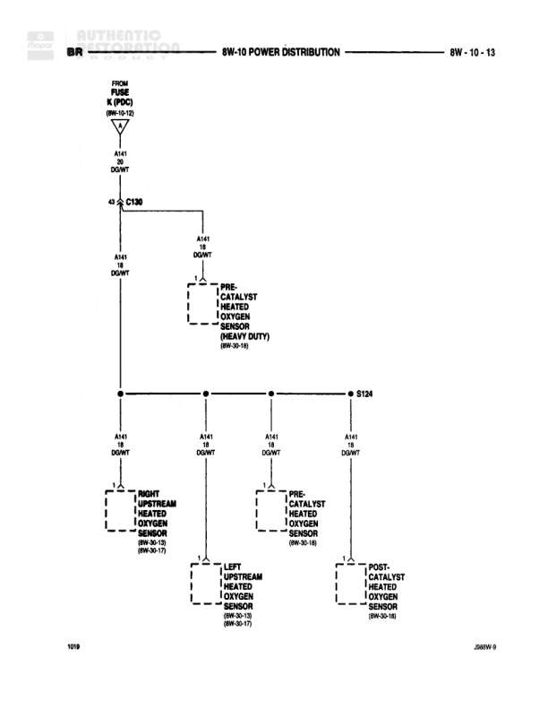

# POWER DISTRIBUTION

**Notes:** Power distribution diagram for heated oxygen sensors. Shows distribution from FUSE K (PDC) through connector C130 to multiple oxygen sensors including heavy duty variant. Reference note (8W-10-12) indicates previous page connection. Diagram 1/1/19 indicates date. All A141 wires are WT/DG (White with Dark Green tracer).

## Components

| Component | Ref | Connectors | Notes |
|-----------|-----|------------|-------|
| PRE-CATALYST HEATED OXYGEN SENSOR (HEAVY DUTY) | 8W-30-18 |  | Connected to power distribution after C130 |
| RIGHT UPSTREAM HEATED OXYGEN SENSOR | 8W-30-18, 28W-30-17 |  |  |
| LEFT UPSTREAM HEATED OXYGEN SENSOR | 8W-30-18, 28W-30-17 |  |  |
| PRE-CATALYST HEATED OXYGEN SENSOR | 8W-30-18 |  |  |
| POST-CATALYST HEATED OXYGEN SENSOR | 8W-30-18 |  |  |

## Wires

| From | To | Wire Code | Gauge | Color | Notes |
|------|-----|-----------|-------|-------|-------|
| FUSE K (PDC) | C130 | A141 | None | WT/DG |  |
| C130 | Horizontal distribution point | A141 | None | WT/DG |  |
| C130 | PRE-CATALYST HEATED OXYGEN SENSOR (HEAVY DUTY) | A141 | None | WT/DG |  |
| Horizontal distribution point | RIGHT UPSTREAM HEATED OXYGEN SENSOR | A141 | 18 | WT/DG | DOWNWARD |
| Horizontal distribution point | LEFT UPSTREAM HEATED OXYGEN SENSOR | A141 | 18 | WT/DG | DOWNWARD |
| Horizontal distribution point | PRE-CATALYST HEATED OXYGEN SENSOR | A141 | 18 | WT/DG | DOWNWARD |
| Horizontal distribution point | S134 | A141 | 18 | WT/DG |  |
| S134 | POST-CATALYST HEATED OXYGEN SENSOR | A141 | 18 | WT/DG | DOWNWARD |

## Splices & Grounds

| ID | Type | Location | Wires Connected | Notes |
|----|------|----------|-----------------|-------|
| C130 | connector | Near top of diagram, after FUSE K | A141 |  |
| S134 | splice | Right side of horizontal distribution | A141 | Connects to POST-CATALYST HEATED OXYGEN SENSOR |

## Cross-References

- 8W-30-18
- 28W-30-17
