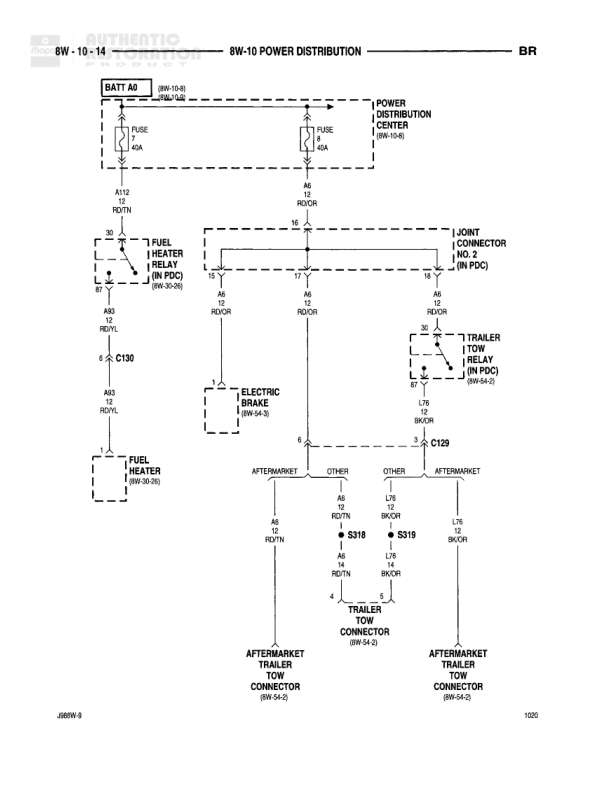

# POWER DISTRIBUTION

**Notes:** Power distribution diagram showing battery feed through Power Distribution Center to fuel heater system, trailer tow relay, and electric brake system. Includes aftermarket trailer tow connections. Diagram reference: J08W-9 and 1020.

## Components

| Component | Ref | Connectors | Notes |
|-----------|-----|------------|-------|
| BATT A0 | 8W-10-01 |  | Battery feed starting point |
| POWER DISTRIBUTION CENTER | 8W-10-02 |  | Main power distribution point |
| FUEL HEATER RELAY | 8W-30-01 |  | Located at NOS position |
| FUEL HEATER | 8W-30-26 |  | Connected via relay |
| ELECTRIC BRAKE | 8W-64-05 |  | Electric brake system |
| TRAILER TOW RELAY | 8W-64-01 |  | Located at M position, in PDC |
| JOINT CONNECTOR NO. 2 | IN PDC |  | Junction point in Power Distribution Center |
| TRAILER TOW CONNECTOR | 8W-67-2 |  | Main trailer connection, 4-way |
| AFTERMARKET TRAILER TOW CONNECTOR | 8W-67-5 |  | Left side aftermarket connection |
| AFTERMARKET TRAILER TOW CONNECTOR | 8W-67-5 |  | Right side aftermarket connection |

## Wires

| From | To | Wire Code | Gauge | Color | Notes |
|------|-----|-----------|-------|-------|-------|
| BATT A0 | FUSE 40A | A12 | 10 | RD/TN | Battery feed to fuse |
| FUSE 40A | POWER DISTRIBUTION CENTER | A6 | 10 | RD/OR | From battery fuse to PDC |
| POWER DISTRIBUTION CENTER | FUSE 40A | A6 | 10 | RD/OR | PDC fused output |
| FUSE 40A (PDC) | NOS position | A6 | 10 | RD/OR | To NOS relay position |
| NOS position | FUEL HEATER RELAY | A83 | 10 | TN/WT | Power to fuel heater relay |
| FUEL HEATER RELAY | C130 | A83 | 10 | TN/WT | Through relay coil |
| C130 | FUEL HEATER | A83 | 10 | RD/YL | Power to fuel heater |
| FUSE 40A (PDC) | M6 position | A6 | 10 | RD/OR | To M6 relay position |
| M6 position | JOINT CONNECTOR NO. 2 | A6 | 10 | RD/OR | To joint connector |
| M6 position | ELECTRIC BRAKE | A6 | 10 | RD/OR | Power to electric brake |
| JOINT CONNECTOR NO. 2 | M position | A6 | 10 | RD/OR | To M relay position |
| M position | TRAILER TOW RELAY | A6 | 10 | RD/OR | Power to trailer tow relay |
| TRAILER TOW RELAY | C130 | L75 | 12 | BK/OR | Relay output |
| C130 | TRAILER TOW CONNECTOR pin 4 | L75 | 12 | BK/OR | To trailer connector |
| ELECTRIC BRAKE pin 6 | AFTERMARKET TRAILER TOW CONNECTOR | A6 | 10 | RD/TN | Left aftermarket connection |
| TRAILER TOW CONNECTOR pin 1 | S318 | A6 | 10 | RD/TN | Main connector to splice |
| S318 | AFTERMARKET TRAILER TOW CONNECTOR | L75 | 14 | BK/OR | Splice to left aftermarket |
| TRAILER TOW CONNECTOR pin 2 | S319 | A6 | 10 | RD/TN | Main connector to splice |
| S319 | AFTERMARKET TRAILER TOW CONNECTOR | L75 | 14 | BK/OR | Splice to right aftermarket |
| TRAILER TOW CONNECTOR pin 3 | AFTERMARKET TRAILER TOW CONNECTOR | L75 | 12 | BK/OR | Direct connection to right aftermarket |

## Splices & Grounds

| ID | Type | Location | Wires Connected | Notes |
|----|------|----------|-----------------|-------|
| S318 | splice | Between trailer tow connector and aftermarket connectors | A6, L75 | Connects main trailer connector pin 1 to left aftermarket |
| S319 | splice | Between trailer tow connector and aftermarket connectors | A6, L75 | Connects main trailer connector pin 2 to right aftermarket |
| C130 | inline_connector | Between fuel heater relay and fuel heater, also trailer tow relay to connector | A83, L75 | Multiple inline connectors labeled C130 |

## Cross-References

- 8W-10-01
- 8W-10-02
- 8W-30-01
- 8W-30-26
- 8W-64-01
- 8W-64-05
- 8W-67-2
- 8W-67-5
