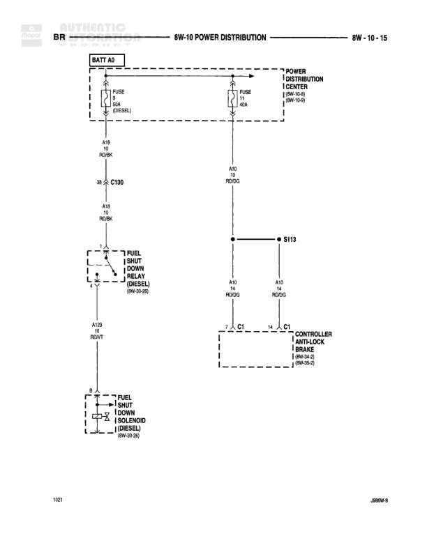

# POWER DISTRIBUTION

**Notes:** This diagram shows power distribution for diesel engine fuel shut down system and anti-lock brake controller. The fuel shut down relay and solenoid are diesel-specific components. Two separate battery feeds are shown - one through BATT A0 for the fuel system, and one through the Power Distribution Center for the ABS system.

## Components

| Component | Ref | Connectors | Notes |
|-----------|-----|------------|-------|
| BATT A0 | top left |  | Battery feed source |
| POWER DISTRIBUTION CENTER | 8W-10-0 |  | Main power distribution center |
| FUEL SHUT DOWN RELAY (DIESEL) | 8W-10-25 |  | Controls fuel shut down for diesel engine |
| FUEL SHUT DOWN SOLENOID (DIESEL) | 8W-70-88 |  | Fuel shut down solenoid for diesel engine |
| CONTROLLER ANTI-LOCK BRAKES | 8W-34-1, 8W-34-2, 8W-36-3 | C1 | Anti-lock brake system controller |

## Wires

| From | To | Wire Code | Gauge | Color | Notes |
|------|-----|-----------|-------|-------|-------|
| BATT A0 | FUSE 5A (DIESEL) | None | None | None | Battery feed to fuse |
| FUSE 5A (DIESEL) | C130 | A10 | 18 | RD/DG | None |
| C130 | FUEL SHUT DOWN RELAY (DIESEL) | A10 | 18 | RD/DG | None |
| POWER DISTRIBUTION CENTER | FUSE 4A | None | None | None | Feed from power distribution center |
| FUSE 4A | S113 | A10 | 14 | RD/DG | None |
| S113 | CONTROLLER ANTI-LOCK BRAKES C1 | A10 | 14 | RD/DG | None |
| S113 | CONTROLLER ANTI-LOCK BRAKES C1 | A10 | 14 | RD/DG | Second connection from splice |
| FUEL SHUT DOWN RELAY (DIESEL) | FUEL SHUT DOWN SOLENOID (DIESEL) | A125 | 18 | RD/WT | None |

## Splices & Grounds

| ID | Type | Location | Wires Connected | Notes |
|----|------|----------|-----------------|-------|
| S113 | splice | Between power distribution center and anti-lock brake controller | A10 | Splits power feed to dual connections on anti-lock brake controller |

## Cross-References

- 8W-10-0
- 8W-10-25
- 8W-70-88
- 8W-34-1
- 8W-34-2
- 8W-36-3
