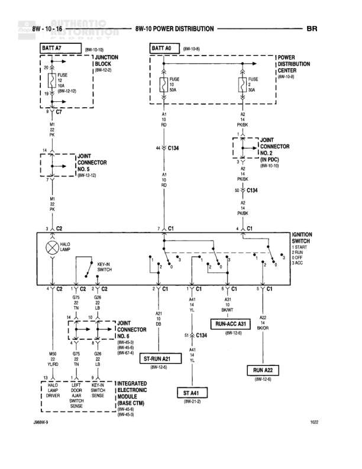

# 8W-10 POWER DISTRIBUTION

**Notes:** Power distribution diagram showing battery feeds, junction block, power distribution center, and ignition switch connections. Includes park lamp, door switches, and integrated electronic cluster connections. Document reference: 268RN-9 and 1032.

## Components

| Component | Ref | Connectors | Notes |
|-----------|-----|------------|-------|
| BATT A7 | 8W-10-16 |  | Battery feed source |
| JUNCTION BLOCK | 8W-12-0 |  | Contains FUSE 12 (10A) and FUSE 14 (50A) |
| BATT A0 | 8W-10-16 |  | Battery feed source with (8W-10A) notation |
| POWER DISTRIBUTION CENTER | 8W-10-8 |  | Contains FUSE 10A and FUSE 50A |
| JOINT CONNECTOR NO. 5 | 8W-10-12 | C2 |  |
| JOINT CONNECTOR NO. 2 (IN PDC) | 8W-10-10 | C134 |  |
| PARK LAMP |  | C2 |  |
| KEY-IN SWITCH |  | C2 |  |
| IGNITION SWITCH |  | C1 | Positions: OFF, RUN, START, LOCK |
| JOINT CONNECTOR NO. 8 | 8W-40-3 | C2 |  |
| RUN-ACC A31 | 8W-12-6 | C134 |  |
| ST-RUN A21 | 8W-12-6 |  |  |
| RUN A22 | 8W-12-6 |  |  |
| ST A41 | 8W-21-2 |  |  |
| HALO LAMP |  | C2 |  |
| LEFT DOOR SWITCH |  |  |  |
| KEY-IN SWITCH |  |  |  |
| INTEGRATED ELECTRONIC CLUSTER (BASE CTM) | 8W-40-8 |  |  |
| RIGHT DOOR SWITCH SENSE | 8W-40-3 |  |  |

## Wires

| From | To | Wire Code | Gauge | Color | Notes |
|------|-----|-----------|-------|-------|-------|
| BATT A7 | JUNCTION BLOCK | A7 | 10 | RD | 8W-10-14A |
| JUNCTION BLOCK FUSE 12 | JOINT CONNECTOR NO. 5 | A7 | 14 | RD/PK |  |
| BATT A0 | POWER DISTRIBUTION CENTER | A0 | 10 | RD |  |
| POWER DISTRIBUTION CENTER FUSE 14 | JOINT CONNECTOR NO. 2 | A2 | 14 | PK/BK |  |
| POWER DISTRIBUTION CENTER FUSE 10 | C134 | A0 | 14 | RD |  |
| JOINT CONNECTOR NO. 5 | C2 Pin 3 | A2 | 14 | PK/BK |  |
| C134 Pin 45 | IGNITION SWITCH | A0 | 14 | RD |  |
| C134 Pin 50 | IGNITION SWITCH | A2 | 14 | PK/BK |  |
| IGNITION SWITCH C1 Pin 7 | C1 Pin 2 | A21 | 18 | DG |  |
| IGNITION SWITCH C1 Pin 1 | C1 Pin 3 | A31 | 18 | VT |  |
| IGNITION SWITCH C1 Pin 4 | C1 Pin 5 | A41 | 18 | YL |  |
| C2 Pin 3 | PARK LAMP | A2 | 18 | PK |  |
| PARK LAMP | C2 Pin 4 | Z2 | 20 | TN |  |
| C2 Pin 2 | KEY-IN SWITCH | G32 | 22 | LB |  |
| KEY-IN SWITCH | C2 Pin 5 | Z2 | 22 | TN |  |
| C1 Pin 5 | ST A41 | A41 | 18 | YL |  |
| C1 Pin 2 | ST-RUN A21 | A21 | 18 | DG |  |
| ST-RUN A21 | C134 Pin 51 | A21 | 18 | DG |  |
| C1 Pin 3 | RUN-ACC A31 | A31 | 18 | VT |  |
| RUN-ACC A31 | C134 Pin 44 | A31 | 18 | VT |  |
| C1 Pin 3 | RUN A22 | A22 | 18 | BK/WT |  |
| C2 Pin 2 | JOINT CONNECTOR NO. 8 | M60 | 18 | YL/BK |  |
| C2 Pin 5 | JOINT CONNECTOR NO. 8 | G75 | 18 | TN |  |
| C2 Pin 4 | JOINT CONNECTOR NO. 8 | G58 | 18 | DB |  |
| JOINT CONNECTOR NO. 8 | HALO LAMP | M60 | 18 | YL/BK |  |
| JOINT CONNECTOR NO. 8 | LEFT DOOR SWITCH | G75 | 18 | TN |  |
| JOINT CONNECTOR NO. 8 | KEY-IN SWITCH | G58 | 18 | DB |  |
| LEFT DOOR SWITCH | INTEGRATED ELECTRONIC CLUSTER | M40 | 20 | BR |  |
| KEY-IN SWITCH | INTEGRATED ELECTRONIC CLUSTER | M31 | 20 | LG |  |
| RIGHT DOOR SWITCH SENSE | INTEGRATED ELECTRONIC CLUSTER | M41 | 20 | BR/WT |  |

## Splices & Grounds

| ID | Type | Location | Wires Connected | Notes |
|----|------|----------|-----------------|-------|
| C2 | splice | Multiple locations | A2, Z2, G32, G58, G75, M60 | In-line connector used at multiple points |
| C1 | splice | Ignition switch area | A0, A2, A21, A22, A31, A41 | In-line connector for ignition circuits |
| C134 | splice | Joint Connector No. 2 | A0, A2, A21, A31 | In-line connector at PDC |

## Cross-References

- 8W-10-14A
- 8W-12-0
- 8W-10A
- 8W-10-8
- 8W-10-12
- 8W-10-10
- 8W-40-3
- 8W-12-6
- 8W-21-2
- 8W-40-8
