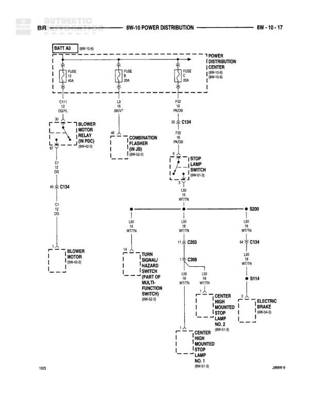

# POWER DISTRIBUTION

**Notes:** Diagram shows power distribution from battery through Power Distribution Center to various circuits including blower motor, lighting, and brake systems

## Components

| Component | Ref | Connectors | Notes |
|-----------|-----|------------|-------|
| POWER DISTRIBUTION CENTER | 8W-10-9 |  | Main power distribution point |
| BLOWER MOTOR RELAY (BLACK) | 8W-42-0 |  | None |
| COMBINATION FLASHER (IN JB) | 8W-50-1 |  | None |
| DOME LAMP SWITCH | 8W-51-0 |  | None |
| BLOWER MOTOR | 8W-42-0 | C134 | None |
| TURN SIGNAL/HAZARD SWITCH (PART OF MULTI-FUNCTION SWITCH) | 8W-50-3 | C308 | None |
| CENTER HIGH MOUNTED STOP LAMP NO. 2 | 8W-61-3 |  | None |
| CENTER HIGH MOUNTED STOP LAMP NO. 1 | 8W-61-3 |  | None |
| ELECTRIC BRAKE | 8W-54-3 |  | None |

## Wires

| From | To | Wire Code | Gauge | Color | Notes |
|------|-----|-----------|-------|-------|-------|
| BATT A0 (8W-10-8) | FUSE 12 30A | A0 | 12 | RD | None |
| BATT A0 (8W-10-8) | FUSE 18 30A | A0 | 12 | RD | None |
| BATT A0 (8W-10-8) | FUSE 21 30A | A0 | 12 | RD | None |
| FUSE 12 (PDC) | C131 | C1 | 20 | WT/TN | None |
| C131 | BLOWER MOTOR RELAY | C1 | 20 | WT/TN | None |
| FUSE 18 (8W-??) | COMBINATION FLASHER (IN JB) 8W-50-1 | None | 18 | WT/VT | None |
| FUSE 21 (PDC) (8W-10-8) | C134 | F29 | 20 | PK/DB | None |
| C134 | DOME LAMP SWITCH (8W-51-0) | F29 | 20 | PK/DB | None |
| BLOWER MOTOR RELAY | C134 | C1 | 20 | WT/TN | None |
| C134 | BLOWER MOTOR | C1 | 20 | WT/TN | None |
| DOME LAMP SWITCH | L50 | L50 | 18 | WT/TN | None |
| L50 | S200 | L50 | 18 | WT/TN | None |
| S200 | L50 | L50 | 18 | WT/TN | None |
| S200 | L50 | L50 | 18 | WT/TN | None |
| S200 L50 | C203 | L50 | 18 | WT/TN | None |
| C203 | TURN SIGNAL/HAZARD SWITCH (PART OF MULTI-FUNCTION SWITCH) (8W-50-3) | L50 | 18 | WT/TN | None |
| C203 | C308 | L50 | 18 | WT/TN | None |
| S200 | C134 | L50 | 18 | WT/TN | None |
| C134 | S114 | L50 | 18 | WT/TN | None |
| C308 | CENTER HIGH MOUNTED STOP LAMP NO. 2 | L50 | 18 | WT/TN | None |
| C308 | CENTER HIGH MOUNTED STOP LAMP NO. 1 | L50 | 18 | WT/TN | None |
| S114 | ELECTRIC BRAKE (8W-54-3) | L50 | 18 | WT/TN | None |

## Splices & Grounds

| ID | Type | Location | Wires Connected | Notes |
|----|------|----------|-----------------|-------|
| C131 | connector | Between PDC and Blower Motor Relay | C1 | None |
| C134 | connector | Multiple connection point | F29, C1, L50 | Connects to Blower Motor, Dome Lamp Switch, and S200 |
| S200 | splice | Central distribution point for L50 circuit | L50 | Distributes to multiple circuits |
| C203 | connector | Between S200 and Turn Signal/Hazard Switch | L50 | None |
| C308 | connector | At Turn Signal/Hazard Switch | L50 | None |
| S114 | splice | Before Electric Brake | L50 | None |

## Cross-References

- 8W-10-8
- 8W-10-9
- 8W-42-0
- 8W-50-1
- 8W-50-3
- 8W-51-0
- 8W-54-3
- 8W-61-3
