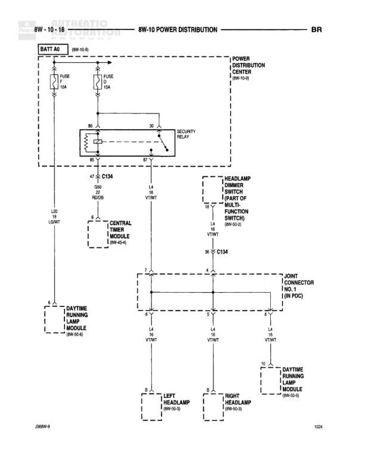

# 8W-10 POWER DISTRIBUTION

**Notes:** Power distribution diagram showing battery feed through security relay to headlamp circuits and daytime running lamp modules. System includes central timer module and headlamp dimmer switch control.

## Components

| Component | Ref | Connectors | Notes |
|-----------|-----|------------|-------|
| BATT A0 | 8W-10-18 |  | Battery feed source |
| POWER DISTRIBUTION CENTER | 8W-10-8 |  | Main power distribution point |
| SECURITY RELAY | diagram | 85, 86, 87, 30 | Controls power distribution |
| CENTRAL TIMER MODULE | 8W-42-4 |  | Timer control module |
| HEADLAMP DIMMER SWITCH (PART OF MULTI-FUNCTION SWITCH) | 8W-40-2 |  | Controls headlamp dimmer |
| DAYTIME RUNNING LAMP MODULE | 8W-50-6 |  | DRL module - left side |
| LEFT HEADLAMP | 8W-50-3 |  | Left headlamp assembly |
| RIGHT HEADLAMP | 8W-50-3 |  | Right headlamp assembly |
| DAYTIME RUNNING LAMP MODULE | 8W-50-6 |  | DRL module - right side |
| JOINT CONNECTOR NO. 1 (IN PDC) | diagram |  | Junction point in Power Distribution Center |

## Wires

| From | To | Wire Code | Gauge | Color | Notes |
|------|-----|-----------|-------|-------|-------|
| BATT A0 | FUSE 10A | None | None | None | Battery feed to fuse |
| BATT A0 | FUSE 15A | None | None | None | Battery feed to fuse |
| FUSE 10A | SECURITY RELAY (Pin 30) | None | 16 | None | Power input to relay |
| FUSE 15A | SECURITY RELAY (Pin 30) | None | 16 | None | Power input to relay |
| SECURITY RELAY (Pin 87) | C134 | None | None | None | Relay output |
| C134 | CENTRAL TIMER MODULE | None | 14 | VT/WT | Power to timer module |
| C134 | HEADLAMP DIMMER SWITCH | None | 14 | VT/WT | Power to dimmer switch |
| C134 (D10 BZDB) | L30 LG/WT | None | None | None | Connection point |
| HEADLAMP DIMMER SWITCH | C134 | None | 14 | VT/WT | Dimmer switch output |
| C134 | JOINT CONNECTOR NO. 1 | None | 14 | VT/WT | To junction connector |
| JOINT CONNECTOR NO. 1 | LEFT HEADLAMP | None | 14 | VT/WT | Power to left headlamp |
| JOINT CONNECTOR NO. 1 | RIGHT HEADLAMP | None | 14 | VT/WT | Power to right headlamp |
| JOINT CONNECTOR NO. 1 | DAYTIME RUNNING LAMP MODULE (Right) | None | 14 | VT/WT | Power to right DRL module |
| CENTRAL TIMER MODULE | DAYTIME RUNNING LAMP MODULE (Left) | None | None | None | Timer to left DRL module |

## Splices & Grounds

| ID | Type | Location | Wires Connected | Notes |
|----|------|----------|-----------------|-------|
| C134 | connector | Central distribution point | VT/WT circuits | Main connector for headlamp power distribution |

## Cross-References

- 8W-10-8
- 8W-42-4
- 8W-40-2
- 8W-50-6
- 8W-50-3
