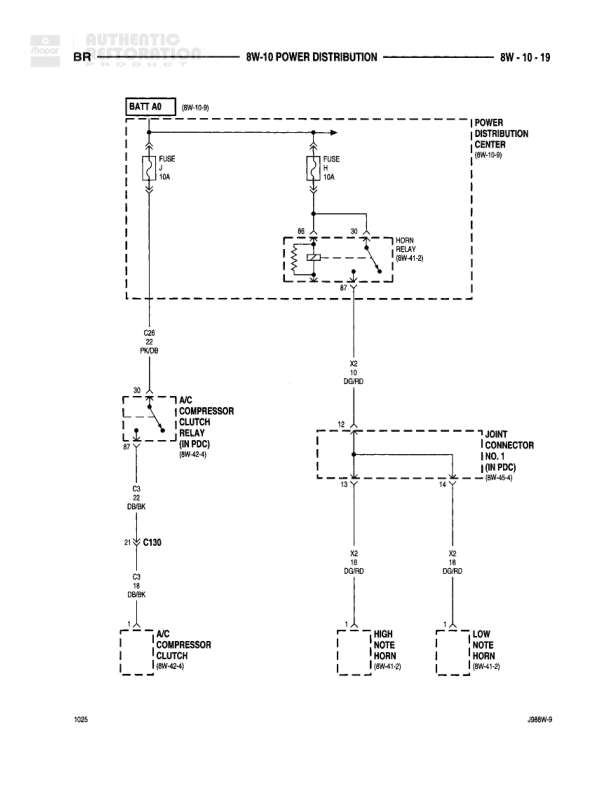

# POWER DISTRIBUTION

**Notes:** This diagram shows power distribution for horn relay, A/C compressor clutch relay, and horn circuits. The diagram includes battery feed from BATT A0, power distribution through the power distribution center, and ground connections. Wire Z2 DG/RD is shared between horn relay and A/C compressor circuits.

## Components

| Component | Ref | Connectors | Notes |
|-----------|-----|------------|-------|
| BATT A0 | 8W-15-9 |  | Battery feed source |
| POWER DISTRIBUTION CENTER | 8W-10-6 |  | Main power distribution |
| HORN RELAY | 8W-41-5 |  | Located in power distribution center |
| A/C COMPRESSOR CLUTCH RELAY | 8W-42-4 |  | Air conditioning compressor control |
| A/C COMPRESSOR CLUTCH | 8W-42-4 | C130 | Air conditioning compressor clutch |
| JOINT CONNECTOR NO. 1 (IN PDC) | 8W-60-4 |  | Junction connector in power distribution center |
| HIGH NOTE HORN | 8W-41-5 |  | High frequency horn |
| LOW NOTE HORN | 8W-41-5 |  | Low frequency horn |

## Wires

| From | To | Wire Code | Gauge | Color | Notes |
|------|-----|-----------|-------|-------|-------|
| BATT A0 | FUSE 1 (10A) | None | None | None | Battery feed to fuse 1 |
| BATT A0 | FUSE 2 (10A) | None | None | None | Battery feed to fuse 2 |
| FUSE 1 | G0 | Z2 | None | BK/OR | Ground connection from fuse 1 |
| FUSE 2 | HORN RELAY | B2 | None | None | Feed to horn relay |
| HORN RELAY | CAP | None | None | None | Capacitor connection |
| HORN RELAY | G2 | Z2 | None | DG/RD | Ground connection from horn relay |
| G2 | A/C COMPRESSOR CLUTCH RELAY | Z2 | None | DG/RD | Ground to A/C relay |
| A/C COMPRESSOR CLUTCH RELAY | G3 | Z1 | None | DB/BK | Ground from A/C relay |
| A/C COMPRESSOR CLUTCH RELAY | C130 | Z1 | None | DB/BK | Feed to A/C compressor clutch |
| C130 | A/C COMPRESSOR CLUTCH | Z1 | None | DB/BK | Connection to compressor clutch |
| JOINT CONNECTOR NO. 1 | X2 | V2 | None | DG/RD | Feed from joint connector to horn circuit left |
| JOINT CONNECTOR NO. 1 | X2 | V2 | None | DG/RD | Feed from joint connector to horn circuit right |
| X2 (left) | HIGH NOTE HORN | X2 | None | DG/RD | Feed to high note horn |
| X2 (right) | LOW NOTE HORN | X2 | None | DG/RD | Feed to low note horn |

## Splices & Grounds

| ID | Type | Location | Wires Connected | Notes |
|----|------|----------|-----------------|-------|
| G0 | ground | Near fuse 1 |  | Ground for fuse 1 circuit |
| G2 | ground | Between horn relay and A/C relay |  | Shared ground point for horn relay and A/C relay |
| G3 | ground | Below A/C compressor clutch relay |  | Ground for A/C compressor clutch circuit |

## Cross-References

- 8W-15-9
- 8W-10-6
- 8W-41-5
- 8W-42-4
- 8W-60-4
