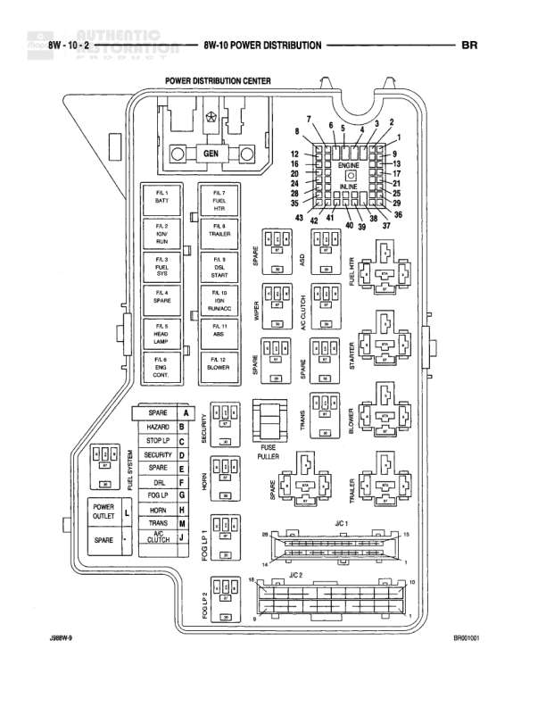

# POWER DISTRIBUTION CENTER

**Notes:** This diagram shows the Power Distribution Center (PDC) layout with fuse locations (FL 1-12), relay positions (A-L), and engine controller connector pinout. The PDC is the main electrical distribution point for the vehicle's power systems. Reference drawing number J08W-9, dated BR901201.

## Components

| Component | Ref | Connectors | Notes |
|-----------|-----|------------|-------|
| Power Distribution Center | 8W-10-2 |  | Main power distribution center for vehicle showing fuse and relay layout |
| Generator (GEN) | Top center of PDC |  | Located at top of power distribution center |
| Engine Controller (ENGINE CONT) | Right side connector block |  | Multi-pin connector numbered 1-28 plus additional pins 30, 37-43 |
