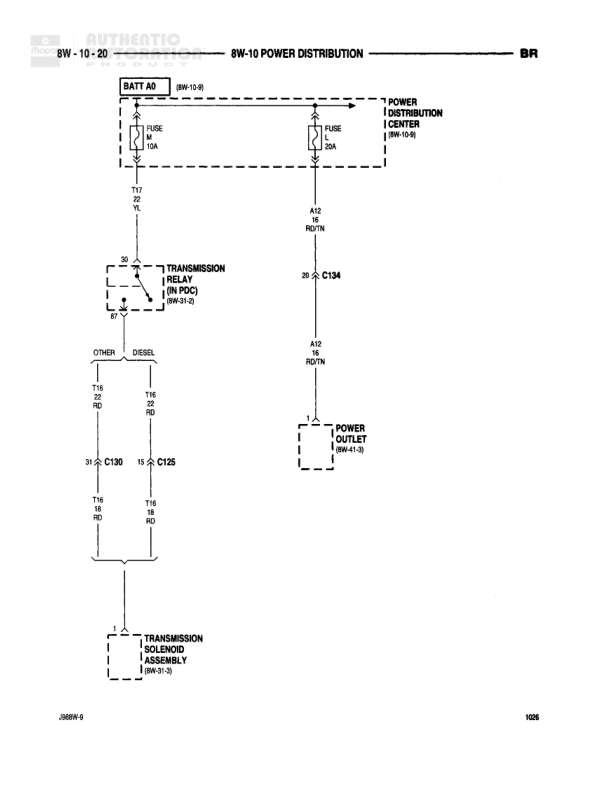

# Power Distribution

**Notes:** Diagram shows power distribution for transmission components with separate paths for OTHER and DIESEL configurations. Both T18 wires (18 gauge Red) converge at the Transmission Solenoid Assembly.

## Components

| Component | Ref | Connectors | Notes |
|-----------|-----|------------|-------|
| Battery (BATT A0) | 8W-10-9 |  | Battery feed source |
| Power Distribution Center | 8W-10-9 |  | PDC location reference |
| Transmission Relay (IN PDC) | 8W-91-2 |  | Located in Power Distribution Center |
| Power Outlet | 8W-41-9 |  | Power outlet location |
| Transmission Solenoid Assembly | 8W-91-9 |  | Final component in circuit |

## Wires

| From | To | Wire Code | Gauge | Color | Notes |
|------|-----|-----------|-------|-------|-------|
| BATT A0 | FUSE (10A) | A2 | 12 | RD | Battery feed to fuse |
| FUSE (10A) | Transmission Relay | A2 | 12 | RD | From fuse to relay |
| Power Distribution Center | FUSE (20A) | A42 | 12 | RD/TN | Feed from PDC |
| FUSE (20A) | C134 | A42 | 12 | RD/TN | To connector C134 |
| C134 | C130 (OTHER path) | A12 | 12 | RD/TN | Split to C130 for OTHER |
| C134 | C126 (DIESEL path) | A12 | 12 | RD/TN | Split to C126 for DIESEL |
| C134 | Power Outlet | A12 | 12 | RD/TN | To power outlet |
| C130 | Transmission Solenoid Assembly | T18 | 18 | RD | OTHER path to transmission |
| C126 | Transmission Solenoid Assembly | T18 | 18 | RD | DIESEL path to transmission |

## Cross-References

- 8W-10-9
- 8W-91-2
- 8W-41-9
- 8W-91-9
