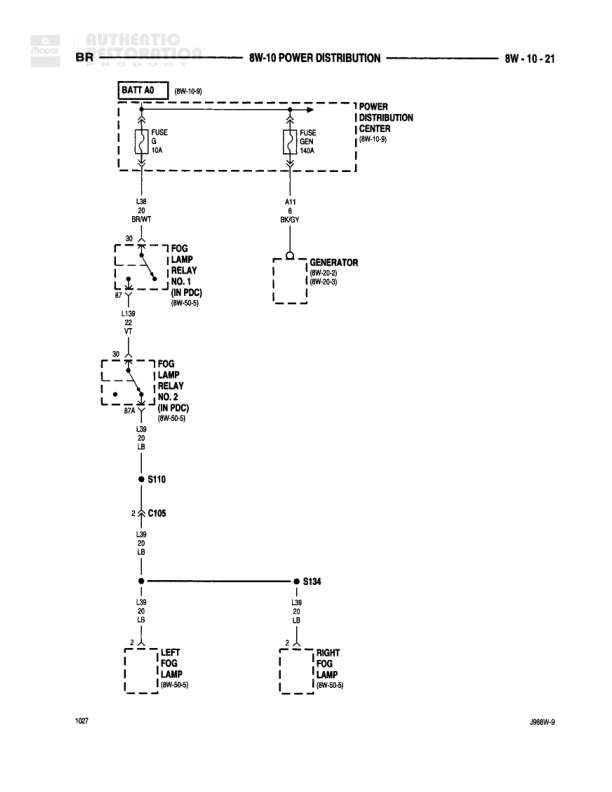

# POWER DISTRIBUTION

**Notes:** Diagram shows fog lamp power distribution and generator charging circuit. Fog lamps controlled through two relays in PDC. Battery feed (A0) and exterior lighting circuit (L38) shown.

## Components

| Component | Ref | Connectors | Notes |
|-----------|-----|------------|-------|
| Battery | BATT A0 (8W-10-0) |  | Battery feed source |
| Power Distribution Center | 8W-10-0 |  | Main power distribution |
| Fog Lamp Relay No. 1 | IN PDC (8W-20-0) | 30, 87, 85, 86 | Located in Power Distribution Center |
| Fog Lamp Relay No. 2 | IN PDC (8W-20-0) | 30, 87A, 87 | Located in Power Distribution Center |
| Generator | 8W-20-0, 8W-60-0 |  | Charging system |
| Left Fog Lamp | 8W-50-8 |  | Front left fog lamp |
| Right Fog Lamp | 8W-50-8 |  | Front right fog lamp |

## Wires

| From | To | Wire Code | Gauge | Color | Notes |
|------|-----|-----------|-------|-------|-------|
| BATT A0 | FUSE 11 (40A) | L38 | 10 | BR/WT | Battery feed to fuse |
| FUSE 11 (40A) | Fog Lamp Relay No. 1 (Pin 30) | L38M | 12 | VT | Power to relay |
| Fog Lamp Relay No. 1 (Pin 87) | Fog Lamp Relay No. 2 (Pin 30) | L38 | 20 | LB | Between relays |
| Fog Lamp Relay No. 2 (Pin 87A) | S110 | L38 | 20 | LB | To splice S110 |
| S110 | C105 | L38 | 20 | LB | Through connector C105 |
| C105 | S134 | L38 | 20 | LB | To splice S134 |
| S134 (left branch) | Left Fog Lamp | L38 | 20 | LB | To left fog lamp |
| S134 (right branch) | Right Fog Lamp | L38 | 20 | LB | To right fog lamp |
| Power Distribution Center | FUSE 14 (40A) | A11 | 8 | RD/GY | Fused power feed |
| FUSE 14 (40A) | Generator | A11 | 8 | RD/GY | To generator |

## Splices & Grounds

| ID | Type | Location | Wires Connected | Notes |
|----|------|----------|-----------------|-------|
| S110 | splice | Between fog lamp relay and C105 | L38 | Fog lamp circuit splice |
| S134 | splice | Distribution point for fog lamps | L38 | Splits to left and right fog lamps |

## Cross-References

- 8W-10-0
- 8W-20-0
- 8W-50-8
- 8W-60-0
