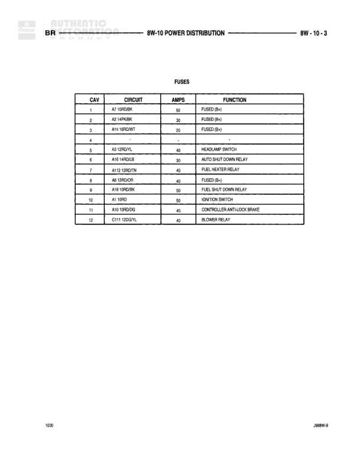

# POWER DISTRIBUTION - FUSES

**Notes:** This diagram shows the fuse cavity assignments for the power distribution system. The table lists cavity numbers 1-12 with their respective circuits, amperage ratings, and functions. Cavity 4 is empty.
