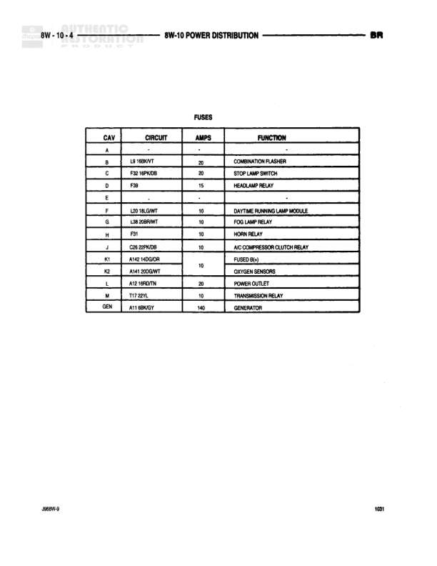

# POWER DISTRIBUTION - FUSES

**Notes:** This is a fuse listing table showing cavity assignments, circuit identifications, amperages, and functions for the power distribution system. Document reference XBBW-3, page 1001.
