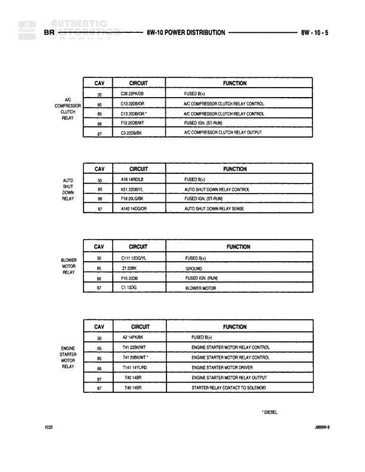

# POWER DISTRIBUTION

**Notes:** * DIESEL. This diagram shows relay configurations for various power distribution circuits including A/C compressor clutch, auto shut down, blower motor, and diesel engine starter motor control. Page 10/25 from service manual J69W-5.

## Components

| Component | Ref | Connectors | Notes |
|-----------|-----|------------|-------|
| A/C COMPRESSOR CLUTCH RELAY | 8W-10-5 | C85, C86, C86, C87 | Air conditioning compressor clutch control relay |
| AUTO SHUT DOWN RELAY | 8W-10-5 | C30, C85, C86, C87 | Automatic shutdown relay |
| BLOWER MOTOR RELAY | 8W-10-5 | C30, C85, C86, C87 | Controls blower motor |
| ENGINE STARTER MOTOR RELAY | 8W-10-5 | C30, C85, C86, C85, C87, C87 | Diesel engine starter motor relay |

## Wires

| From | To | Wire Code | Gauge | Color | Notes |
|------|-----|-----------|-------|-------|-------|
| A/C COMPRESSOR CLUTCH RELAY - C30 | FUSED B(+) | C26 | None | 28YBOR | None |
| A/C COMPRESSOR CLUTCH RELAY - C85 | AC COMPRESSOR CLUTCH RELAY CONTROL | C13 | None | 20GNOR | None |
| A/C COMPRESSOR CLUTCH RELAY - C86 | AC COMPRESSOR CLUTCH RELAY CONTROL | C13 | None | 20GNOR * | None |
| A/C COMPRESSOR CLUTCH RELAY - C86 | FUSED (JCL, RT-RUN) | F12 | None | 20GNWT | None |
| A/C COMPRESSOR CLUTCH RELAY - C87 | AC COMPRESSOR CLUTCH RELAY OUTPUT | C13 | None | 20RDBK | None |
| AUTO SHUT DOWN RELAY - C30 | FUSED B(+) | A16 | None | 14RDL3 | None |
| AUTO SHUT DOWN RELAY - C85 | AUTO SHUT DOWN RELAY CONTROL | K51 | None | 20WHVL | None |
| AUTO SHUT DOWN RELAY - C86 | FUSED (JCL, RT-RUN) | F16 | None | 20LGRK | None |
| AUTO SHUT DOWN RELAY - C87 | AUTO SHUT DOWN RELAY SENSE | A16 | None | 14GNOR | None |
| BLOWER MOTOR RELAY - C30 | FUSED B(+) | C11 | None | 10DGVL | None |
| BLOWER MOTOR RELAY - C85 | GROUND | Z1 | None | 22BK | None |
| BLOWER MOTOR RELAY - C86 | FUSED (JCL RUN) | F16 | None | 20GN | None |
| BLOWER MOTOR RELAY - C87 | BLOWER MOTOR | C1 | None | 12DG | None |
| ENGINE STARTER MOTOR RELAY - C30 | FUSED B(+) | A2 | None | 14PKBK | None |
| ENGINE STARTER MOTOR RELAY - C85 | ENGINE STARTER MOTOR RELAY CONTROL | T41 | None | 22WHWT | None |
| ENGINE STARTER MOTOR RELAY - C86 | ENGINE STARTER MOTOR RELAY CONTROL | T41 | None | 20WHWT * | None |
| ENGINE STARTER MOTOR RELAY - C85 | ENGINE STARTER MOTOR DRIVER | T641 | None | 14T14G | None |
| ENGINE STARTER MOTOR RELAY - C87 | ENGINE STARTER MOTOR RELAY OUTPUT | T40 | None | 14BR | None |
| ENGINE STARTER MOTOR RELAY - C87 | STARTER RELAY CONTACT TO SOLENOID | T40 | None | 14BR | None |
