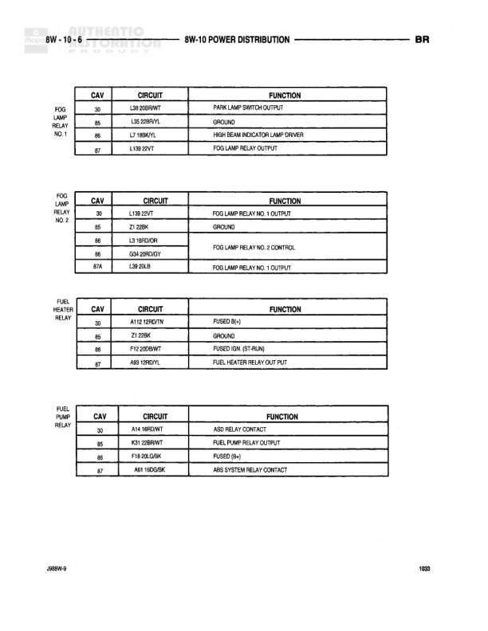

# POWER DISTRIBUTION

**Notes:** Power distribution diagram showing relay configurations and pin assignments for fog lamp relays, fuel heater relay, and fuel pump relay. Diagram shows cavity (CAV), circuit codes, and function descriptions for each relay terminal.

## Components

| Component | Ref | Connectors | Notes |
|-----------|-----|------------|-------|
| FOG LAMP RELAY NO. 1 | 8W-10-6 | C30, C85, C86, C87 | Park lamp switch output relay |
| FOG LAMP RELAY NO. 2 | 8W-10-6 | C30, C85, C86, C86, C87A | Fog lamp control relay |
| FUEL HEATER RELAY | 8W-10-6 | C30, C85, C86, C87 | Controls fuel heater |
| FUEL PUMP RELAY | 8W-10-6 | C30, C85, C86, C87 | Controls fuel pump and ABS system |

## Wires

| From | To | Wire Code | Gauge | Color | Notes |
|------|-----|-----------|-------|-------|-------|
| FOG LAMP RELAY NO. 1/C30 | None | L39 | None | DB/WT | PARK LAMP SWITCH OUTPUT |
| FOG LAMP RELAY NO. 1/C85 | None | L39 | None | DB/YL | GROUND |
| FOG LAMP RELAY NO. 1/C86 | None | L7 | None | YL | HIGH BEAM INDICATOR LAMP DIMMER |
| FOG LAMP RELAY NO. 1/C87 | None | L138 | None | PK/VT | FOG LAMP RELAY OUTPUT |
| FOG LAMP RELAY NO. 2/C30 | None | L138 | None | PK/VT | FOG LAMP RELAY NO. 1 OUTPUT |
| FOG LAMP RELAY NO. 2/C85 | None | Z1 | None | BK | GROUND |
| FOG LAMP RELAY NO. 2/C86 | None | L3 | None | BR/OR | FOG LAMP RELAY NO. 2 CONTROL |
| FOG LAMP RELAY NO. 2/C86 | None | G04 | None | DB/GY | FOG LAMP RELAY NO. 2 CONTROL |
| FOG LAMP RELAY NO. 2/C87A | None | L98 | None | DB/LB | FOG LAMP RELAY NO. 1 OUTPUT |
| FUEL HEATER RELAY/C30 | None | A114 | None | RD/TN | FUSED (B+) |
| FUEL HEATER RELAY/C85 | None | Z1 | None | BK | GROUND |
| FUEL HEATER RELAY/C86 | None | F12 | None | DB/WT | FUSED IGN. (ST-RUN) |
| FUEL HEATER RELAY/C87 | None | A69 | None | RD/VL | FUEL HEATER RELAY OUTPUT |
| FUEL PUMP RELAY/C30 | None | A14 | None | WT | ASD RELAY CONTACT |
| FUEL PUMP RELAY/C85 | None | K31 | None | DB/WT | FUEL PUMP RELAY OUTPUT |
| FUEL PUMP RELAY/C86 | None | F18 | None | LG/BK | FUSED (B+) |
| FUEL PUMP RELAY/C87 | None | A61 | None | DG/BK | ABS SYSTEM RELAY CONTACT |
