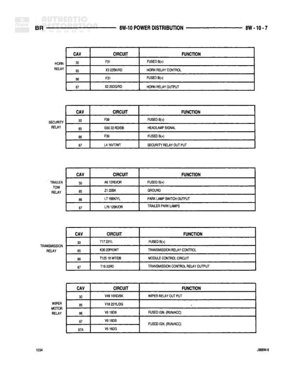

# POWER DISTRIBUTION

**Notes:** This diagram shows power distribution relay tables for Horn, Security, Trailer Tow, Transmission, and Wiper Motor relays. Each relay table shows cavity numbers, circuit codes, and functions.

## Components

| Component | Ref | Connectors | Notes |
|-----------|-----|------------|-------|
| HORN RELAY | 8W-10-7 | C4, C5, C6, C7 | Horn relay control and output |
| SECURITY RELAY | 8W-10-7 | C90, C92, C6, C7 | Security relay with headlamp signal |
| TRAILER TOW RELAY | 8W-10-7 | C30, C6, C6, C7 | Trailer park lamps and park lamp switch output |
| TRANSMISSION RELAY | 8W-10-7 | C30, C5, C6, C7 | Transmission relay control and module control circuit |
| WIPER MOTOR RELAY | 8W-10-7 | C3, C5, C6, C8, C67A | Wiper relay output and fused circuits |

## Wires

| From | To | Wire Code | Gauge | Color | Notes |
|------|-----|-----------|-------|-------|-------|
| HORN RELAY C4 | None | F31 | None | None | FUSED (Bc) |
| HORN RELAY C5 | None | X3 22BK/RD | 22 | BK/RD | HORN RELAY CONTROL |
| HORN RELAY C6 | None | F31 | None | None | FUSED (Bc) |
| HORN RELAY C7 | None | X2 20DG/RD | 20 | DG/RD | HORN RELAY OUTPUT |
| SECURITY RELAY C90 | None | F90 | None | None | FUSED (Bc) |
| SECURITY RELAY C92 | None | G90 22 RD/DB | 22 | RD/DB | HEADLAMP SIGNAL |
| SECURITY RELAY C6 | None | F90 | None | None | FUSED (Bc) |
| SECURITY RELAY C7 | None | L4 16VT/WT | 16 | VT/WT | SECURITY RELAY OUTPUT |
| TRAILER TOW RELAY C30 | None | A6 10RD/OR | 10 | RD/OR | FUSED (Bc) |
| TRAILER TOW RELAY C6 | None | Z1 20BK | 20 | BK | GROUND |
| TRAILER TOW RELAY C6 | None | L7 14BR/YL | 14 | BR/YL | PARK LAMP SWITCH OUTPUT |
| TRAILER TOW RELAY C7 | None | L76 12BK/OR | 12 | BK/OR | TRAILER PARK LAMPS |
| TRANSMISSION RELAY C30 | None | T17 22YL | 22 | YL | FUSED (Bc) |
| TRANSMISSION RELAY C5 | None | K26 20PK/WT | 20 | PK/WT | TRANSMISSION RELAY CONTROL |
| TRANSMISSION RELAY C6 | None | T125 1A WT/DB | None | WT/DB | MODULE CONTROL CIRCUIT |
| TRANSMISSION RELAY C7 | None | T18 22RD | 22 | RD | TRANSMISSION CONTROL RELAY OUTPUT |
| WIPER MOTOR RELAY C3 | None | V49 14RD/BK | 14 | RD/BK | WIPER RELAY OUTPUT |
| WIPER MOTOR RELAY C5 | None | V18 20YL/GY | 20 | YL/GY | None |
| WIPER MOTOR RELAY C6 | None | V6 14GR | 14 | GY | FUSED (2PL RUN/ACC) |
| WIPER MOTOR RELAY C8 | None | V6 14GR | 14 | GY | FUSED (2PL RUN/ACC) |
| WIPER MOTOR RELAY C67A | None | V6 14GR | 14 | GY | None |
