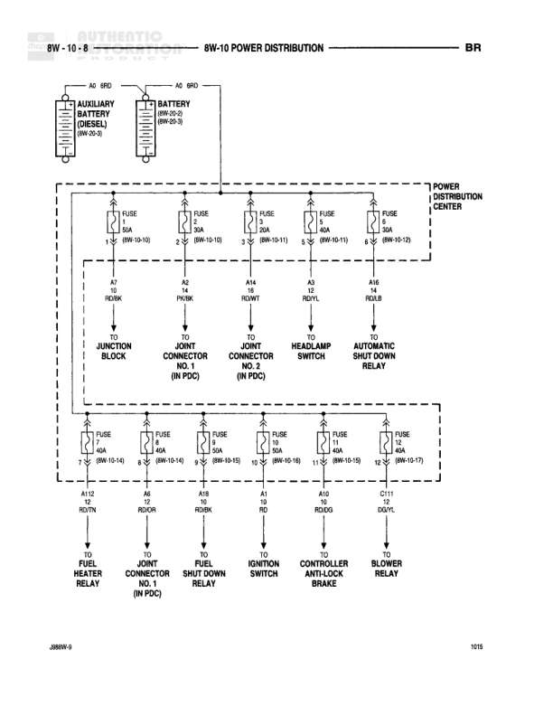

# POWER DISTRIBUTION

**Notes:** This diagram shows the main power distribution from the battery and auxiliary battery (diesel) through the Power Distribution Center to various vehicle systems. All fuses are located in the Power Distribution Center and distribute battery feed (A circuit) power to downstream components.

## Components

| Component | Ref | Connectors | Notes |
|-----------|-----|------------|-------|
| Auxiliary Battery (Diesel) | 8W-10-8 |  | A5 (RD) |
| Battery | 8W-10-8 |  | 8W-20-2, 8W-30-3, A2 (RD) |
| Power Distribution Center | 8W-10-8 |  | Contains multiple fuses distributing power |
| Junction Block | 8W-10-8 |  | TO JUNCTION BLOCK |
| Joint Connector No. 1 (In PDC) | 8W-10-8 |  | TO JOINT CONNECTOR NO. 1 (IN PDC) |
| Joint Connector No. 2 (In PDC) | 8W-10-8 |  | TO JOINT CONNECTOR NO. 2 (IN PDC) |
| Headlamp Switch | 8W-10-8 |  | TO HEADLAMP SWITCH |
| Automatic Shut Down Relay | 8W-10-8 |  | TO AUTOMATIC SHUT DOWN RELAY |
| Fuel Heater (In PDC) | 8W-10-8 |  | TO FUEL HEATER (IN PDC) |
| Joint Connector No. 1 (In PDC) | 8W-10-8 |  | TO JOINT CONNECTOR NO. 1 (IN PDC) - second instance |
| Fuel Shut Down Relay | 8W-10-8 |  | TO FUEL SHUT DOWN RELAY |
| Ignition Switch | 8W-10-8 |  | TO IGNITION SWITCH |
| Controller Antilock Brake | 8W-10-8 |  | TO CONTROLLER ANTILOCK BRAKE |
| Blower Relay | 8W-10-8 |  | TO BLOWER RELAY |

## Wires

| From | To | Wire Code | Gauge | Color | Notes |
|------|-----|-----------|-------|-------|-------|
| Auxiliary Battery (Diesel) | Power Distribution Center | A5 | None | RD | From auxiliary battery to PDC |
| Battery | Power Distribution Center | A2 | None | RD | From main battery to PDC |
| Power Distribution Center FUSE 1 (10A) | Junction Block | A7 | None | RD/BK | 8W-10-10 |
| Power Distribution Center FUSE 2 (10A) | Joint Connector No. 1 (In PDC) | A4 | None | PK/BK | None |
| Power Distribution Center FUSE 3 (30A) | Joint Connector No. 2 (In PDC) | A14 | None | RD/WT | 8W-10-11 |
| Power Distribution Center FUSE 4 (30A) | Headlamp Switch | A3 | None | RD/YL | 8W-10-11 |
| Power Distribution Center FUSE 5 (30A) | Automatic Shut Down Relay | A16 | None | RD/WT | 8W-10-13 |
| Power Distribution Center FUSE 6 (30A) | Fuel Heater (In PDC) | A112 | None | RD/TN | 8W-10-14 |
| Power Distribution Center FUSE 7 (40A) | Joint Connector No. 1 (In PDC) | A6 | None | RD/OR | 8W-10-14 |
| Power Distribution Center FUSE 8 (40A) | Fuel Shut Down Relay | A18 | None | RD/BK | 8W-10-14 |
| Power Distribution Center FUSE 9 (30A) | Ignition Switch | A1 | None | RD | 8W-10-16 |
| Power Distribution Center FUSE 10 (30A) | Controller Antilock Brake | A42 | None | RD/DG | 8W-10-16 |
| Power Distribution Center FUSE 11 (40A) | Blower Relay | D11 | None | DG/YL | 8W-10-17 |

## Cross-References

- 8W-20-2
- 8W-30-3
- 8W-10-10
- 8W-10-11
- 8W-10-13
- 8W-10-14
- 8W-10-16
- 8W-10-17
