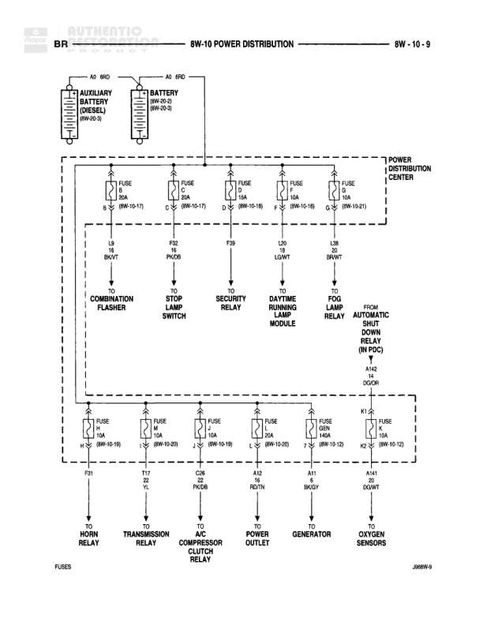

# POWER DISTRIBUTION

**Notes:** J6699-9. This diagram shows the power distribution from the Power Distribution Center to various vehicle systems including lighting, transmission, A/C, and sensors. Auxiliary battery shown for diesel vehicles only.

## Components

| Component | Ref | Connectors | Notes |
|-----------|-----|------------|-------|
| AUXILIARY BATTERY (DIESEL) | 8W-10-9 |  | Diesel vehicles only |
| BATTERY | 8W-10-2, 8W-10-9 |  |  |
| COMBINATION FLASHER |  |  |  |
| STOP LAMP SWITCH |  |  |  |
| SECURITY RELAY |  |  |  |
| DAYTIME RUNNING LAMP MODULE |  |  |  |
| FOG LAMP RELAY |  |  |  |
| AUTOMATIC SHUT DOWN RELAY | 8W-10-1 |  |  |
| HORN RELAY |  |  |  |
| TRANSMISSION RELAY |  |  |  |
| A/C COMPRESSOR CLUTCH RELAY |  |  |  |
| POWER OUTLET |  |  |  |
| GENERATOR |  |  |  |
| OXYGEN SENSORS |  |  |  |

## Wires

| From | To | Wire Code | Gauge | Color | Notes |
|------|-----|-----------|-------|-------|-------|
| AUXILIARY BATTERY | A0 GRD | A0 | None | GRD |  |
| BATTERY | A0 RPC | A0 | None | RPC |  |
| POWER DISTRIBUTION CENTER | COMBINATION FLASHER | F11 | 14 | BK/YT | Via FUSE 5 12A (8W-10-17) |
| POWER DISTRIBUTION CENTER | STOP LAMP SWITCH | F17 | 16 | PK/DB | Via FUSE 6 12A (8W-10-1) |
| POWER DISTRIBUTION CENTER | SECURITY RELAY | F30 | None |  | Via FUSE 17A (8W-10-18) |
| POWER DISTRIBUTION CENTER | DAYTIME RUNNING LAMP MODULE | F16 | 18 | LG/WT | Via FUSE 18 (8W-10-18) |
| POWER DISTRIBUTION CENTER | FOG LAMP RELAY | F08 | 18 | BR/WT | Via FUSE 19 (8W-10-1) |
| AUTOMATIC SHUT DOWN RELAY | POWER DISTRIBUTION CENTER | A1G | 10 | DKGR | From 8W-10-1 |
| POWER DISTRIBUTION CENTER | HORN RELAY | F17 | 16 | PK/DB | Via FUSE 7 10A (8W-10-18) |
| POWER DISTRIBUTION CENTER | TRANSMISSION RELAY | F17 | 18 | PL | Via FUSE 14 10A (8W-10-20) |
| POWER DISTRIBUTION CENTER | A/C COMPRESSOR CLUTCH RELAY | C08 | 18 | PK/DB | Via FUSE 3 10A (8W-10-18) |
| POWER DISTRIBUTION CENTER | POWER OUTLET | A12 | 16 | RD/TN | Via FUSE 20A (8W-10-20) |
| POWER DISTRIBUTION CENTER | GENERATOR | A11 | 16 | BR/GY | Via FUSE 11 15A (8W-10-18) |
| POWER DISTRIBUTION CENTER | OXYGEN SENSORS | A141 | 16 | DG/WT | Via FUSE K1 15A (8W-10-12) |

## Cross-References

- 8W-10-9
- 8W-10-2
- 8W-10-17
- 8W-10-1
- 8W-10-18
- 8W-10-20
- 8W-10-12
