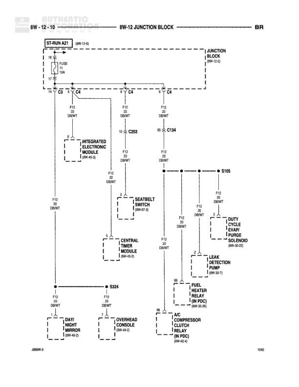

# 8W-12 JUNCTION BLOCK - BR

**Notes:** This diagram shows the BR (Brown) circuit distribution from Junction Block through fuse 3A, primarily distributing F12 (DB/WT - Dark Blue/White) circuits to various modules and components. Power originates from ST-RUN A21 circuit.

## Components

| Component | Ref | Connectors | Notes |
|-----------|-----|------------|-------|
| ST-RUN A21 | 8W-12-8 |  | Start-Run power source |
| JUNCTION BLOCK | 8W-12-8 |  | Main junction block with fuse |
| INTEGRATED ELECTRONIC MODULE | 8W-45-3 | C203 |  |
| SEATBELT SWITCH | 8W-67-5 |  |  |
| CENTRAL TIMER MODULE | 8W-45-2 |  |  |
| DUTY CYCLE CANISTER PURGE SOLENOID | 8W-60-10 |  |  |
| LEAK DETECTION PUMP | 8W-30-7 |  |  |
| FUEL HEATER RELAY | 8W-20-10, IN PDC |  |  |
| A/C COMPRESSOR CLUTCH RELAY | 8W-40-4, IN PDC |  |  |
| DAY/NIGHT MIRROR | 8W-48-2 |  |  |
| OVERHEAD CONSOLE | 8W-48-2 |  |  |

## Wires

| From | To | Wire Code | Gauge | Color | Notes |
|------|-----|-----------|-------|-------|-------|
| ST-RUN A21 | FUSE 3A | None | 18 | None | From 8W-12-8 |
| FUSE 3A | Junction Block distribution points | F12 | None | DB/WT |  |
| Junction Block | C203 Pin 10 | F12 | None | DB/WT | To Integrated Electronic Module |
| Junction Block | C134 Pin 95 | F12 | None | DB/WT |  |
| C203 Pin 10 | Integrated Electronic Module | F12 | None | DB/WT |  |
| Integrated Electronic Module | F12 DB/WT distribution | F12 | None | DB/WT |  |
| F12 distribution | Seatbelt Switch | F12 | None | DB/WT |  |
| F12 distribution | Central Timer Module | F12 | None | DB/WT |  |
| C134 Pin 95 | F12 main distribution | F12 | None | DB/WT |  |
| F12 distribution | S105 | F12 | None | DB/WT |  |
| F12 distribution | Duty Cycle Canister Purge Solenoid | F12 | None | DB/WT |  |
| F12 distribution | Leak Detection Pump | F12 | None | DB/WT |  |
| F12 distribution | Fuel Heater Relay Pin 86 | F12 | None | DB/WT | In PDC |
| F12 distribution | A/C Compressor Clutch Relay Pin 86 | F12 | None | DB/WT | In PDC |
| F12 distribution | Day/Night Mirror | F12 | None | DB/WT |  |
| F12 distribution | Overhead Console | F12 | None | DB/WT |  |
| Central Timer Module | S324 | F12 | None | DB/WT |  |

## Splices & Grounds

| ID | Type | Location | Wires Connected | Notes |
|----|------|----------|-----------------|-------|
| S105 | splice | Multiple F12 circuit connections | F12 | Distribution point for DB/WT circuits |
| S324 | splice | Near Day/Night Mirror and Overhead Console | F12 | Distribution point for DB/WT circuits |

## Cross-References

- 8W-12-8
- 8W-45-3
- 8W-67-5
- 8W-45-2
- 8W-60-10
- 8W-30-7
- 8W-20-10
- 8W-40-4
- 8W-48-2
