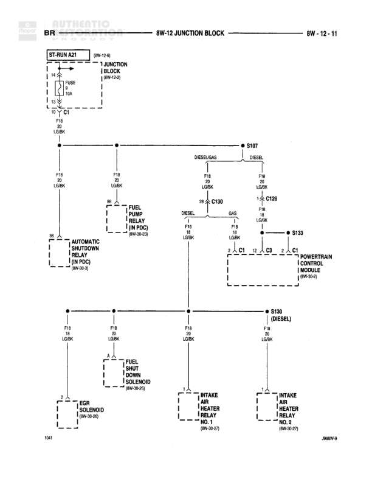

# Powertrain BR Circuit - Junction Block Distribution

**Notes:** This diagram shows the BR (Brown) circuit distribution from the ST-RUN A21 relay through the junction block to various powertrain components. The circuit splits between diesel and gas configurations at S107, with diesel-specific components (fuel shut down solenoid, intake air heater relays) on a separate branch through S130. All components receive power through F18 (20 gauge LG/BK wire) from a 10A fuse in the junction block.

## Components

| Component | Ref | Connectors | Notes |
|-----------|-----|------------|-------|
| ST-RUN A21 | 8W-12-8 |  | Start-Run relay A21 |
| Junction Block | 8W-12-8 |  | 1 Junction Block |
| Fuel Pump Relay | 8W-30-28 |  | In PDC |
| Automatic Shutdown Relay | 8W-30-28 |  | In PDC |
| Powertrain Control Module | 8W-30-2 | C1, C2, C3 | Three connectors shown |
| Fuel Shut Down Solenoid | 8W-30-26 |  | Diesel specific |
| EGR Solenoid No. 3 | 8W-30-26 |  |  |
| Intake Air Heater Relay No. 1 | 8W-30-27 |  | Diesel specific |
| Intake Air Heater Relay No. 2 | 8W-30-27 |  | Diesel specific |

## Wires

| From | To | Wire Code | Gauge | Color | Notes |
|------|-----|-----------|-------|-------|-------|
| ST-RUN A21 | Junction Block | BR | 14 | BR | From relay to junction block |
| Junction Block FUSE 10A | S107 node | F18 | 20 | LG/BK |  |
| S107 node | Fuel Pump Relay | F18 | 20 | LG/BK | To pin 85 |
| S107 node | Automatic Shutdown Relay | F18 | 20 | LG/BK | To pin 85 |
| S107 DIESEL/GAS split | C130 DIESEL | F18 | 20 | LG/BK | Diesel path |
| C130 DIESEL | C196 GAS | F18 | 20 | LG/BK |  |
| C196 | S133 | F18 | 20 | LG/BK |  |
| S133 | Powertrain Control Module C1 | F18 | 20 | LG/BK | To connector C1 |
| S133 | Powertrain Control Module C2 | F18 | 20 | LG/BK | To connector C2 |
| S133 | Powertrain Control Module C3 | F18 | 20 | LG/BK | To connector C3 |
| S130 (DIESEL) node | Fuel Shut Down Solenoid | F18 | 20 | LG/BK |  |
| S130 (DIESEL) node | EGR Solenoid No. 3 | F18 | 20 | LG/BK |  |
| S130 (DIESEL) node | Intake Air Heater Relay No. 1 | F18 | 20 | LG/BK |  |
| S130 (DIESEL) node | Intake Air Heater Relay No. 2 | F18 | 20 | LG/BK |  |

## Splices & Grounds

| ID | Type | Location | Wires Connected | Notes |
|----|------|----------|-----------------|-------|
| S107 | splice | Upper section, splits to multiple components | F18 | Splits to Fuel Pump Relay, ASD Relay, and diesel/gas paths |
| C130 | connector | Diesel path junction |  | Diesel specific connector |
| C196 | connector | Gas path junction |  | Gas specific connector |
| S133 | splice | Before Powertrain Control Module | F18 | Splits to three PCM connectors C1, C2, C3 |
| S130 | splice | Lower section diesel components | F18 | Diesel only - splits to fuel solenoid and air heater relays |

## Cross-References

- 8W-12-8
- 8W-30-28
- 8W-30-2
- 8W-30-26
- 8W-30-27
