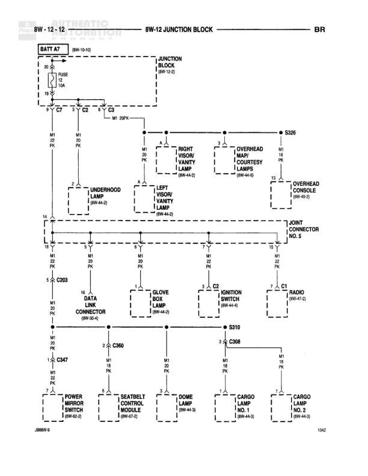

# Interior Lighting - Junction Block to Various Lamps and Switches

**Notes:** Interior lighting distribution from junction block. Diagram shows M1 circuit (Interior Lighting) distribution to various lamps and switches. Multiple T-junctions (T-3 through T-7) and connectors (C2, C3, C6, C7) at junction block. Joint Connector No. 5 serves as distribution point for overhead lighting.

## Components

| Component | Ref | Connectors | Notes |
|-----------|-----|------------|-------|
| BATT A7 | 8W-10-10 |  | Battery feed input |
| JUNCTION BLOCK | 8W-12-0 | C7, C2, C3 | Main distribution point |
| RIGHT VISOR/VANITY LAMP | 8W-44-3 |  | None |
| OVERHEAD MAP/COURTESY LAMPS | 8W-44-3 |  | None |
| UNDERHOOD LAMP | 8W-44-2 |  | None |
| LEFT VISOR/VANITY LAMP | 8W-44-3 |  | None |
| OVERHEAD CONSOLE | 8W-44-3 |  | None |
| DATA LINK CONNECTOR | 8W-30-1 | C203 | None |
| GLOVE BOX LAMP | 8W-44-3 |  | None |
| IGNITION SWITCH | 8W-44-3 |  | None |
| RADIO | 8W-47-2 |  | None |
| POWER MIRROR SWITCH | 8W-60-3 |  | J969r/s |
| SEATBELT COMFORT MODULE | 8W-67-2 |  | None |
| DOME LAMP | 8W-44-3 |  | None |
| CARGO LAMP NO. 1 | 8W-44-3 |  | None |
| CARGO LAMP NO. 2 | 8W-44-3 |  | None |

## Wires

| From | To | Wire Code | Gauge | Color | Notes |
|------|-----|-----------|-------|-------|-------|
| BATT A7 | FUSE 12 (10A) | A7 | None | None | 8W-10-10 |
| FUSE 12 | JUNCTION BLOCK C7 | A7 | 18 | PK | None |
| JUNCTION BLOCK C7 | RIGHT VISOR/VANITY LAMP | M1 | 20 | PK | S306 |
| JUNCTION BLOCK C2 | OVERHEAD MAP/COURTESY LAMPS | M1 | 20 | PK | M1 20PK |
| JUNCTION BLOCK C3 | OVERHEAD CONSOLE | M1 | 18 | PK | T3 |
| S306 | UNDERHOOD LAMP | M1 | 20 | PK | None |
| S306 | LEFT VISOR/VANITY LAMP | M1 | 20 | PK | None |
| UNDERHOOD LAMP | JOINT CONNECTOR NO. 5 | M1 | 20 | PK | T4 |
| LEFT VISOR/VANITY LAMP | JOINT CONNECTOR NO. 5 | M1 | 20 | PK | None |
| RIGHT VISOR/VANITY LAMP | JOINT CONNECTOR NO. 5 | M1 | 20 | PK | None |
| OVERHEAD MAP/COURTESY LAMPS | JOINT CONNECTOR NO. 5 | M1 | 20 | PK | None |
| OVERHEAD CONSOLE | JOINT CONNECTOR NO. 5 | M1 | 18 | PK | T3 |
| JOINT CONNECTOR NO. 5 | C203 | M1 | 20 | PK | S-5 |
| C203 | DATA LINK CONNECTOR | None | 16 | WT | None |
| C203 | C360 | M1 | 20 | PK | None |
| C360 | C308 | None | None | None | S310 |
| C360 | GLOVE BOX LAMP | M1 | 18 | PK | T-5 |
| C308 | IGNITION SWITCH | M1 | 18 | PK | T-5, C6 |
| C308 | RADIO | M1 | 18 | PK | T-5, C5 |
| C203 | C347 | M1 | 20 | PK | T-6 |
| C347 | POWER MIRROR SWITCH | M1 | 18 | PK | T-7 |
| C347 | SEATBELT COMFORT MODULE | M1 | 18 | PK | T-7 |
| C347 | DOME LAMP | M1 | 18 | PK | T-7 |
| C347 | CARGO LAMP NO. 1 | M1 | 18 | PK | T-7 |
| C347 | CARGO LAMP NO. 2 | M1 | 18 | PK | T-7 |

## Splices & Grounds

| ID | Type | Location | Wires Connected | Notes |
|----|------|----------|-----------------|-------|
| S-5 | splice | Near C203 | M1 | Splits to C360 and C347 |
| S306 | splice | Between junction block and lamps | M1 | Distributes to underhood and left visor lamps |
| S310 | splice | Between C360 and C308 | M1 | None |

## Cross-References

- 8W-10-10
- 8W-12-0
- 8W-30-1
- 8W-44-2
- 8W-44-3
- 8W-47-2
- 8W-60-3
- 8W-67-2
