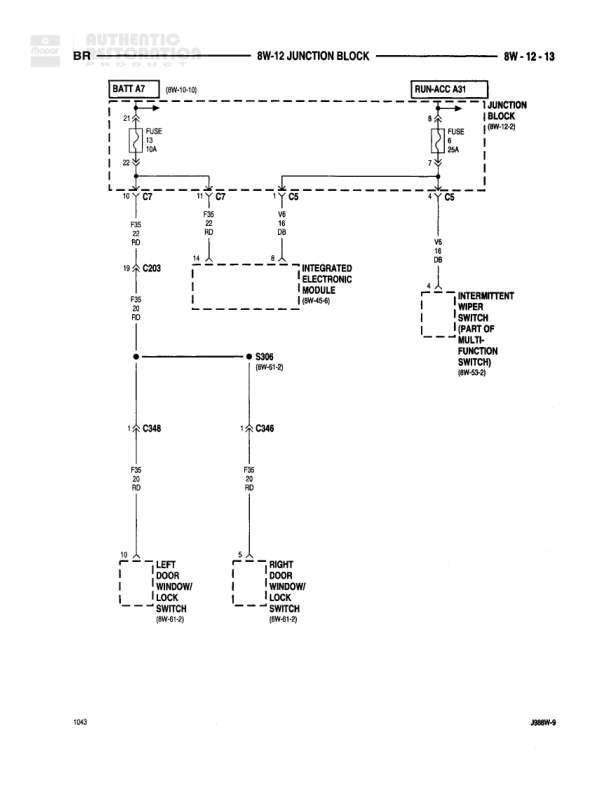

# Door Lock/Unlock Switches

**Notes:** This diagram shows the door lock/unlock control circuit. Power is supplied from both battery feed (BATT A7 through FUSE 13A) and run-accessory feed (RUN-ACC A31 through FUSE 5A). The Integrated Electronic Module controls the lock/unlock functions for both left and right door switches. The intermittent wiper switch contains the door lock/unlock controls as part of the multi-function switch assembly.

## Components

| Component | Ref | Connectors | Notes |
|-----------|-----|------------|-------|
| Junction Block | 8W-12-2 |  | Contains BATT A7 and RUN-ACC A31 |
| Integrated Electronic Module | 8W-45-6 | C203 | Controls door lock/unlock functions |
| Intermittent Wiper Switch (Part of Multi-Function Switch) | 8W-53-2 |  | Contains door lock/unlock controls |
| Left Door Lock/Unlock Switch | 8W-61-5 | C348 | Driver side door switch |
| Right Door Lock/Unlock Switch | 8W-61-5 | C348 | Passenger side door switch |

## Wires

| From | To | Wire Code | Gauge | Color | Notes |
|------|-----|-----------|-------|-------|-------|
| BATT A7 | FUSE 13A | None | None | None | Battery feed at junction block 8W-12-10 |
| FUSE 13A | C7 | None | None | None | None |
| RUN-ACC A31 | FUSE 5A | None | None | None | Run-Accessory feed from junction block 8W-12-2 |
| FUSE 5A | C5 | None | None | None | None |
| C7 | C203 pin 11 | F26 | 20 | RD | From fused battery feed |
| C7 | C5 | F26 | 20 | RD | Continues to intermittent wiper switch |
| C5 | Intermittent Wiper Switch | V6 | None | DB | To multi-function switch 8W-53-2 |
| C203 pin 14 | Integrated Electronic Module | None | None | None | Connection to module 8W-45-6 |
| Integrated Electronic Module | S306 | F26 | 20 | RD | Module 8W-45-6 to splice 8W-61-2 |
| S306 | C348 pin 1 | F26 | 20 | RD | To left door switch |
| S306 | C348 pin 1 | F26 | 20 | RD | To right door switch |
| C348 pin 10 | Left Door Lock/Unlock Switch | None | None | None | Lock control output 8W-61-5 |
| C348 pin 5 | Right Door Lock/Unlock Switch | None | None | None | Unlock control output 8W-61-5 |

## Splices & Grounds

| ID | Type | Location | Wires Connected | Notes |
|----|------|----------|-----------------|-------|
| S306 | splice | Junction point for door lock feeds | F26 | Located at 8W-61-2, distributes power to both door switches |

## Cross-References

- 8W-12-10
- 8W-12-2
- 8W-45-6
- 8W-53-2
- 8W-61-5
- 8W-61-2
