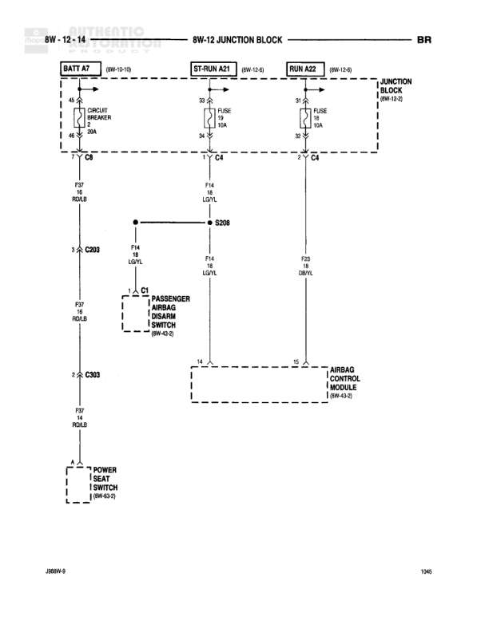

# Airbag System - Power Distribution

**Notes:** This diagram shows power distribution for the airbag system, including connections through the junction block to the passenger airbag disarm switch and airbag control module. Also shows connections to radio speaker and power seat switch.

## Components

| Component | Ref | Connectors | Notes |
|-----------|-----|------------|-------|
| Battery | BATT A7 |  | Battery feed source |
| Radio Speaker | 8W-10-10 | C8 | None |
| ST-RUN A21 | 8W-12-8 | C4 | Start-Run relay or circuit |
| RUN A22 | 8W-12-8 | C4 | Run relay or circuit |
| Junction Block | 8W-12-2 |  | Main junction block |
| Passenger Airbag Disarm Switch | 8W-12-2 |  | None |
| Airbag Control Module | 8W-12-5 |  | None |
| Power Seat Switch | 8W-63-2 |  | None |

## Wires

| From | To | Wire Code | Gauge | Color | Notes |
|------|-----|-----------|-------|-------|-------|
| BATT A7/45 | C8 | None | None | None | Connection to Radio Speaker |
| BATT A7/33 | ST-RUN A21/33 | None | None | None | None |
| BATT A7/39 | RUN A22/39 | None | None | None | None |
| ST-RUN A21/2 (FUSE 10A) | C4 | None | None | None | None |
| RUN A22/2 (FUSE 10A) | C4 | None | None | None | None |
| C8 | F67 (14 RD/LB) | F67 | 14 | RD/LB | None |
| C4 | F14 (18A LG/YL) | F14 | 18 | LG/YL | None |
| C4 | G9 (20 DB/VL) | G9 | 20 | DB/VL | None |
| F14 (18A LG/YL) | S208 | F14 | 18 | LG/YL | None |
| S208 | F14 (18A LG/YL) Passenger Airbag Disarm Switch | F14 | 18 | LG/YL | None |
| C203/3 | F14 (18A LG/YL) | F14 | 18 | LG/YL | None |
| F67 (14 RD/LB) | C203/2 | F67 | 14 | RD/LB | None |
| C303/2 | F67 (14 RD/LB) | F67 | 14 | RD/LB | None |
| Passenger Airbag Disarm Switch/14 | Airbag Control Module/14 | None | None | None | None |
| Airbag Control Module/32 | G9 (20 DB/VL) | G9 | 20 | DB/VL | None |
| C303/4 | Power Seat Switch | None | None | None | None |

## Splices & Grounds

| ID | Type | Location | Wires Connected | Notes |
|----|------|----------|-----------------|-------|
| S208 | splice | Between F14 circuits | F14 | Splits F14 circuit to multiple destinations |

## Cross-References

- 8W-10-10
- 8W-12-8
- 8W-12-2
- 8W-12-5
- 8W-63-2
