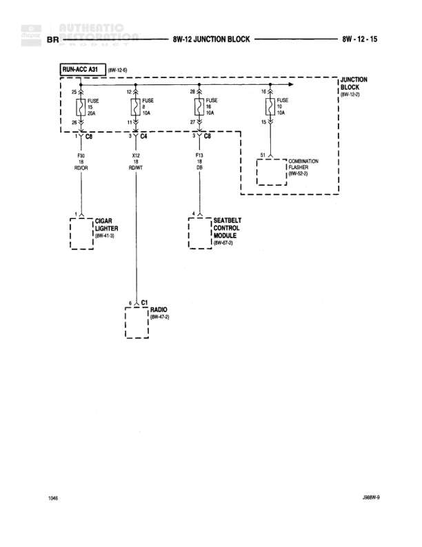

# 8W-12 JUNCTION BLOCK

**Notes:** This diagram shows the RUN-ACC A31 power distribution through the junction block (8W-12) to various accessory circuits including cigar lighter, seatbelt control module, radio, and combination flasher. All fuses are located in the junction block (JB).

## Components

| Component | Ref | Connectors | Notes |
|-----------|-----|------------|-------|
| RUN-ACC A31 | 8W-12-0 |  | Power distribution from RUN-ACC circuit |
| JUNCTION BLOCK | 8W-12-1 |  | Main junction block containing fuses |
| CIGAR LIGHTER | 8W-41-3 | C6 | Accessory power outlet |
| SEATBELT CONTROL MODULE | 8W-67-3 | C4 | Seatbelt warning system control |
| RADIO | 8W-47-0 | C1 | Audio system |
| COMBINATION FLASHER | 8W-60-2 |  | Turn signal and hazard flasher |

## Wires

| From | To | Wire Code | Gauge | Color | Notes |
|------|-----|-----------|-------|-------|-------|
| RUN-ACC A31 | FUSE 10 (JB) Pin 20 | None | None | None | Feed to fuse 10 |
| FUSE 10 (JB) Pin 19 | C6 Pin 1 | P16 | None | OR | To cigar lighter |
| RUN-ACC A31 | FUSE 4 (JB) Pin 12 | None | None | None | Feed to fuse 4 |
| FUSE 4 (JB) Pin 11 | C4 | P17 | None | RD/WT | To seatbelt control module |
| RUN-ACC A31 | FUSE 15 (JB) Pin 28 | None | None | None | Feed to fuse 15 |
| FUSE 15 (JB) Pin 27 | C8 and continuation | P13 | None | DB | To radio and other circuits |
| C8 | C1 | P13 | None | DB | To radio |
| RUN-ACC A31 | FUSE 16 (JB) Pin 14 | None | None | None | Feed to fuse 16 |
| FUSE 16 (JB) Pin 13 | Continuation | P1 | None | None | To combination flasher 8W-60-2 |

## Splices & Grounds

| ID | Type | Location | Wires Connected | Notes |
|----|------|----------|-----------------|-------|
| C6 | connector | Cigar lighter connection | P16 | Connector to cigar lighter |
| C4 | connector | Seatbelt control module connection | P17 | Connector to seatbelt control module |
| C8 | connector | Junction point for P13 circuit | P13 | Distributes power to radio and other circuits |
| C1 | connector | Radio connection | P13 | Connector to radio |

## Cross-References

- 8W-12-0
- 8W-12-1
- 8W-41-3
- 8W-67-3
- 8W-47-0
- 8W-60-2
