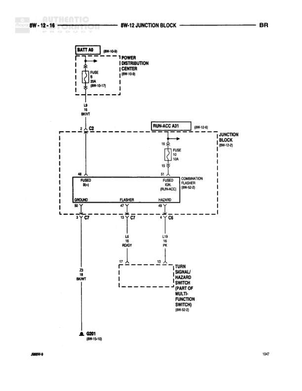

# 8W-12 JUNCTION BLOCK - BR

**Notes:** Diagram shows power distribution from RUN A22 through junction block circuit breaker (30A) to ABS motor controller and airbag control module, with additional feeds to door window/lock switches through splice S304

## Components

| Component | Ref | Connectors | Notes |
|-----------|-----|------------|-------|
| JUNCTION BLOCK | 8W-12-0 |  | Main junction block with circuit breaker and fuses |
| CIRCUIT BREAKER | C/B |  | 30A circuit breaker |
| CONTROLLER ANTI-LOCK | 8W-34-3 | C1 | Also referenced as 8W-36-3 |
| AIRBAG CONTROL MODULE | 8W-43-0 |  |  |
| LEFT DOOR WINDOW/LOCK SWITCH | 8W-60-2 |  |  |
| RIGHT DOOR WINDOW/LOCK SWITCH | 8W-60-2 |  |  |

## Wires

| From | To | Wire Code | Gauge | Color | Notes |
|------|-----|-----------|-------|-------|-------|
| RUN A22 (8W-12-0) | JUNCTION BLOCK CIRCUIT BREAKER | None | None | None |  |
| CIRCUIT BREAKER Pin 1 | JUNCTION BLOCK FUSE 2 | None | None | None |  |
| CIRCUIT BREAKER Pin 1 | JUNCTION BLOCK FUSE 31 | None | None | None |  |
| JUNCTION BLOCK FUSE 2 | C203 Pin 4 | F21 | 14 | TN | ABS Motor |
| JUNCTION BLOCK FUSE 31 | Connector | F26 | 14 | OR/YL | SRS CRVL |
| C203 Pin 4 | CONTROLLER ANTI-LOCK C1 Pin 4 | F21 | 14 | TN |  |
| Connector | AIRBAG CONTROL MODULE Pin 15 | F26 | 14 | OR/YL |  |
| C203 Pin 4 | S304 | F21 | 14 | TN |  |
| S304 | C347 Pin 9 | F21 | 14 | TN |  |
| S304 | C345 Pin 9 | F21 | 14 | TN |  |
| C347 Pin 9 | LEFT DOOR WINDOW/LOCK SWITCH Pin 5 | F21 | 14 | TN |  |
| C345 Pin 9 | RIGHT DOOR WINDOW/LOCK SWITCH Pin 11 | F21 | 14 | TN |  |

## Splices & Grounds

| ID | Type | Location | Wires Connected | Notes |
|----|------|----------|-----------------|-------|
| S304 | splice | Between ABS controller feed and door lock switches | F21 | Splits F21 to left and right door switches |
| C203 | connector | In-line connector | F21 |  |
| C347 | connector | Left door connection | F21 |  |
| C345 | connector | Right door connection | F21 |  |

## Cross-References

- 8W-12-0
- 8W-34-3
- 8W-36-3
- 8W-43-0
- 8W-60-2
