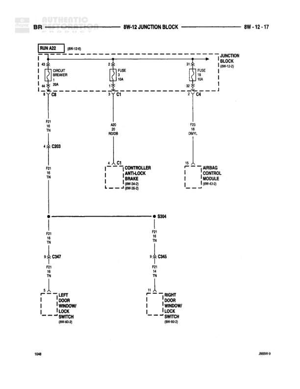

# Brake Controls - Junction Block Distribution

**Notes:** Diagram shows brake control lighting circuit distribution from junction block. Circuit splits to multiple loads including cup holder, ashtray receiver lamp, and daytime running lamp module. Includes GAS/DIESEL/DRL variations and A/T (automatic transmission) vs M/T (manual transmission) configurations. References J869W-9 and FUSE7.

## Components

| Component | Ref | Connectors | Notes |
|-----------|-----|------------|-------|
| Junction Block | 8W-12-12 |  | Main distribution point for brake circuits |
| Cup Holder | 8W-44-5 | C134 |  |
| Ashtray Receiver Lamp | 8W-44-5 |  |  |
| Daytime Running Lamp Module | 8W-60-6 |  |  |
| Park/Neutral Position Switch | 8W-51-12 |  |  |
| Back-Up Lamp Switch | 8W-51-5 |  |  |

## Wires

| From | To | Wire Code | Gauge | Color | Notes |
|------|-----|-----------|-------|-------|-------|
| RUN A22 | Junction Block (8W-12-12) | None | None | None | 8W-15-6 |
| Junction Block Fuse 10A | Q6 | None | None | None |  |
| Q6 | S206 | L10 | 18 | BR/LG |  |
| S206 | Cup Holder | L10 | 18 | BR/LG |  |
| S206 | C134 | L10 | 18 | BR/LG |  |
| S206 | Ashtray Receiver Lamp | L10 | 18 | BR/LG |  |
| C134 | S108 | L10 | 18 | BR/LG |  |
| S108 | C130 (GAS) | L10 | 18 | BR/LG |  |
| S108 | C125 (DIESEL) | L10 | 18 | BR/LG |  |
| S108 | C126 (DRL) | L10 | 18 | BR/LG |  |
| S108 | Daytime Running Lamp Module | L10 | 18 | BR/LG |  |
| C130 | Ground | L10 | 18 | BR/LG | GAS |
| C125 | Ground | L10 | 18 | BR/LG | DIESEL |
| C126 | Ground | L10 | 18 | BR/LG | DRL |
| Park/Neutral Position Switch | Ground | L10 | 18 | BR/LG | A/T |
| Back-Up Lamp Switch | Ground | L10 | 18 | BR/LG | M/T |

## Splices & Grounds

| ID | Type | Location | Wires Connected | Notes |
|----|------|----------|-----------------|-------|
| S206 | splice | Distribution point from Q6 | L10 | Distributes to Cup Holder, C134, and Ashtray Receiver Lamp |
| S108 | splice | Distribution point from C134 | L10 | Distributes to GAS, DIESEL, DRL circuits and Daytime Running Lamp Module |

## Cross-References

- 8W-12-12
- 8W-15-6
- 8W-44-5
- 8W-60-6
- 8W-51-12
- 8W-51-5
