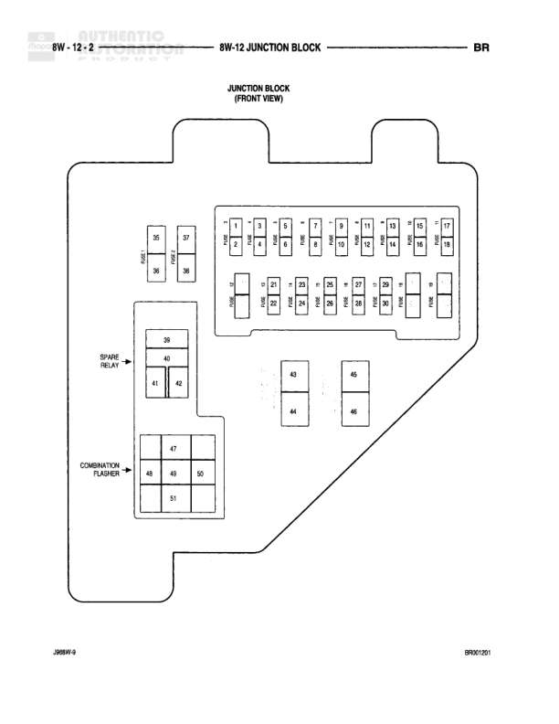

# JUNCTION BLOCK

**Notes:** This is a reference diagram showing the physical layout and position numbers of the junction block fuses and relays. Specific fuse ratings and circuit assignments would be shown on other related diagrams. The junction block is shown from front view with 51 numbered positions including fuses, relays, and the combination flasher module.

## Components

| Component | Ref | Connectors | Notes |
|-----------|-----|------------|-------|
| Junction Block | 8W-12-2 |  | Front View - Main power distribution junction block |
| Spare Relay | Position 39 |  | Located in left section of junction block |
| Combination Flasher | Position 47-51 |  | Located in lower left section of junction block |

## Cross-References

- 8W-12
