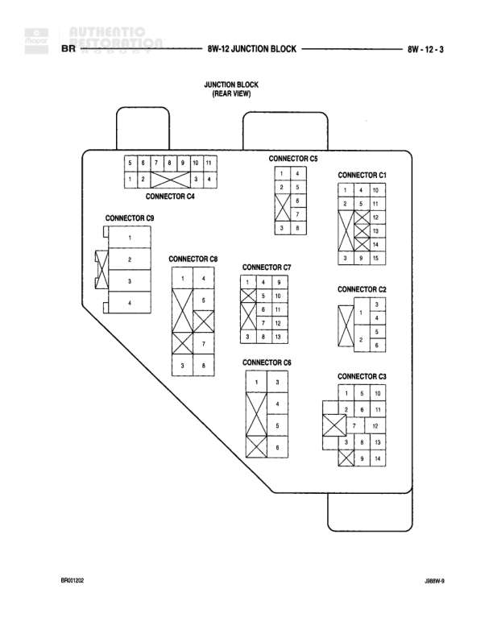

# Junction Block (Rear View)

**Notes:** This is a connector pinout diagram showing the rear view of the junction block with 9 connectors. Connector C1 has 15 pins (numbered 1-15), C2 has 6 pins (numbered 1-6), C3 has 14 pins (numbered 1-14), C4 has 4 pins (numbered 1-4), C5 has 6 pins (numbered 1-6), C6 has 6 pins (numbered 1-6), C7 has 13 pins (numbered 1-13), C8 has 9 pins (numbered 1-9), and C9 has 4 pins (numbered 1-4). X marks indicate unused or unavailable pin positions in the connectors.

## Components

| Component | Ref | Connectors | Notes |
|-----------|-----|------------|-------|
| Junction Block | 8W-12-3 | C1, C2, C3, C4, C5, C6, C7, C8, C9 | Rear view of junction block showing all connector pinouts |
