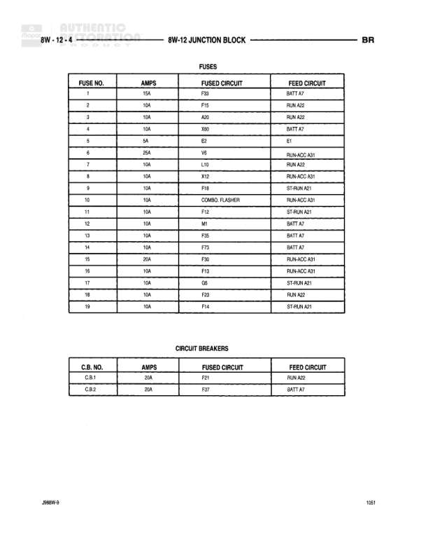

# 8W-12 JUNCTION BLOCK

**Notes:** This diagram shows the fuse and circuit breaker configuration for the 8W-12 Junction Block. It includes 19 fuses ranging from 5A to 25A and 2 circuit breakers at 20A and 30A. Feed circuits include BATT A7, RUN A22, RUN-ACC A31, ST-RUN A21, and E1.
