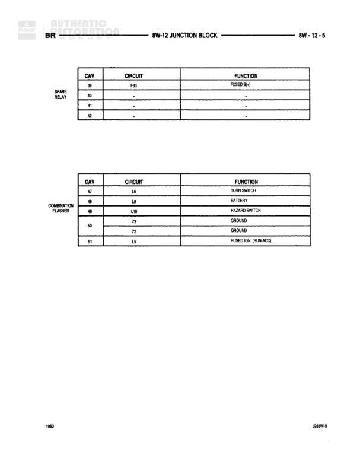

# 8W-12 JUNCTION BLOCK

**Notes:** This diagram shows cavity assignments for the 8W-12 Junction Block. SPARE RELAY cavities: 39=FUSED IGN (F33), 40/41/42=unused. COMBINATION FLASHER cavities: 47=TURN SWITCH (L6), 48=BATTERY (L9), 49=HAZARD SWITCH (L19), 50=GROUND (Z3), 25=GROUND (Z5), 51=FUSED IGN. RUN/ACC (L5)

## Components

| Component | Ref | Connectors | Notes |
|-----------|-----|------------|-------|
| SPARE RELAY | 8W-12 JUNCTION BLOCK |  | Cavity positions 39, 40, 41, 42 |
| COMBINATION FLASHER | 8W-12 JUNCTION BLOCK |  | Cavity positions 47, 48, 49, 50, 25, 51 |
