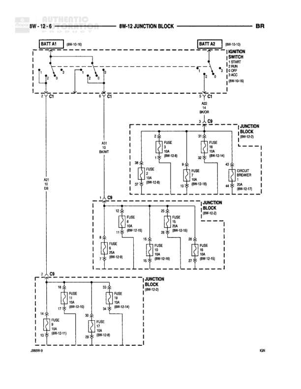

# Junction Block Power Distribution

**Notes:** This diagram shows the power distribution from two battery sources (A1 and A2) through multiple junction blocks. BATT A1 provides continuous power (8 gauge BK/WT), while BATT A2 is connected through the ignition switch (8 gauge BK/OR) and distributes power to multiple fused circuits. The diagram includes multiple junction block sections referenced as 8W-12-5 and 8W-12-2, with power distributed through various amperage fuses to different vehicle systems.

## Components

| Component | Ref | Connectors | Notes |
|-----------|-----|------------|-------|
| Battery A1 | 8W-10-10 | C1 | Primary battery connection |
| Battery A2 | 8W-10-10 | C1 | Connected to ignition switch - RUN, START, OFF, ACCY, LOCK positions (8W-10-18) |
| Junction Block | 8W-12-5 |  | Multiple fuse blocks shown |
| Junction Block | 8W-12-2 |  | Multiple fuse blocks shown |
| Junction Block | 8W-12-2 |  | Additional fuse distribution |

## Wires

| From | To | Wire Code | Gauge | Color | Notes |
|------|-----|-----------|-------|-------|-------|
| BATT A1 C1 | Junction Block (8W-12-5) | A21 | 8 | BK/WT | None |
| BATT A2 C1 | Junction Block (8W-12-5) C9 | A22 | 8 | BK/OR | None |
| Junction Block (8W-12-5) | FUSE 14A | A21 | 12 | BK/WT | None |
| Junction Block (8W-12-5) | FUSE 15A | A21 | 12 | BK/WT | None |
| FUSE 14A | Junction Block output | A21 | 16 | BK/WT | 8W-12-16 |
| FUSE 15A | Junction Block output | A21 | 16 | BK/WT | 8W-12-16 |
| Junction Block (8W-12-5) C9 | FUSE 16A | A22 | 12 | BK/OR | None |
| Junction Block (8W-12-5) C9 | FUSE 17A | A22 | 12 | BK/OR | None |
| FUSE 16A | CIRCUIT BREAKER | A22 | 16 | BK/OR | 8W-12-17 |
| FUSE 17A | Junction Block output | A22 | 16 | BK/OR | 8W-12-16 |
| Junction Block (8W-12-2) C9 | FUSE 18A | A22 | 12 | BK/OR | None |
| Junction Block (8W-12-2) C9 | FUSE 19A | A22 | 12 | BK/OR | None |
| FUSE 18A | Junction Block output | A22 | 16 | BK/OR | 8W-12-15 |
| FUSE 19A | Junction Block output | A22 | 16 | BK/OR | 8W-12-16 |
| Junction Block (8W-12-2) C9 | FUSE 20A | A22 | 12 | BK/OR | None |
| Junction Block (8W-12-2) C9 | FUSE 21A | A22 | 12 | BK/OR | None |
| FUSE 20A | Junction Block output | A22 | 16 | BK/OR | 8W-12-16 |
| FUSE 21A | Junction Block output | A22 | 16 | BK/OR | 8W-12-15 |
| Junction Block (8W-12-2) C9 | FUSE 13A | A22 | 12 | BK/OR | None |
| Junction Block (8W-12-2) C9 | FUSE 6A | A22 | 12 | BK/OR | None |
| FUSE 13A | Junction Block output | A22 | 16 | BK/OR | 8W-12-10 |
| FUSE 6A | Junction Block output | A22 | 16 | BK/OR | 8W-12-14 |
| Junction Block (8W-12-2) C9 | FUSE 5A | A22 | 12 | BK/OR | 2RKW-9 |
| Junction Block (8W-12-2) C9 | FUSE 7A | A22 | 12 | BK/OR | None |
| FUSE 5A | Junction Block output | A22 | 16 | BK/OR | 8W-13-11 |
| FUSE 7A | Junction Block output | A22 | 16 | BK/OR | 8W-12-14 |

## Splices & Grounds

| ID | Type | Location | Wires Connected | Notes |
|----|------|----------|-----------------|-------|
| C1 | connector | BATT A1 connection point | A21 | Battery terminal connection |
| C1 | connector | BATT A2 connection point | A22 | Battery terminal connection to ignition switch |
| C9 | connector | Multiple junction block locations | A22 | Common connection point in junction blocks |

## Cross-References

- 8W-10-10
- 8W-10-18
- 8W-12-5
- 8W-12-2
- 8W-12-16
- 8W-12-17
- 8W-12-15
- 8W-12-14
- 8W-12-10
- 8W-13-11
- 2RKW-9
