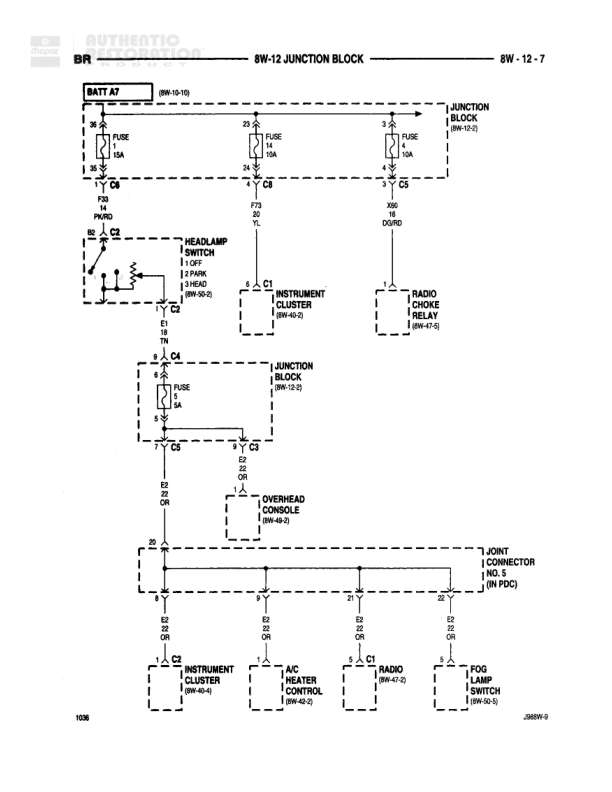

# 8W-12 JUNCTION BLOCK

**Notes:** This diagram shows the junction block power distribution for battery feed (A2) and dimming illumination circuits (E2). The headlamp switch in PARK position provides power to illumination circuits through a 3A fuse. Multiple components share common ground Z2 (Orange wire). Document reference 268W-9 noted at bottom.

## Components

| Component | Ref | Connectors | Notes |
|-----------|-----|------------|-------|
| Battery | BATT A7 |  | 8W-10-10 |
| Junction Block | 8W-12-7 |  | Main power distribution |
| Headlamp Switch | 8W-30-5 | C2 | Controls OFF, PARK, HEAD |
| Instrument Cluster | 8W-40-2 | C1 | First instance |
| Radio Choke Relay | 8W-47-6 |  |  |
| Overhead Console | 8W-43-2 |  |  |
| Joint Connector No. 3 | 8W-13-AC |  | 4-position connector |
| Instrument Cluster | 8W-40-4 | C2 | Second instance |
| A/C Heater Control | 8W-44-2 |  |  |
| Radio | 8W-47-2 | C1 |  |
| Fog Lamp Switch | 8W-30-5 |  |  |

## Wires

| From | To | Wire Code | Gauge | Color | Notes |
|------|-----|-----------|-------|-------|-------|
| BATT A7 | FUSE 14A | A2 | None | None | Battery feed to junction block position 25 |
| FUSE 14A (25) | F70 PWRD | A2 | None | None |  |
| FUSE 14 (25) | F70 20 | A2 | None | None | Junction block center position |
| FUSE 10A (5) | X06 18 DGRD | A2 | None | None | Junction block right position |
| F70 PWRD | Headlamp Switch C2 | A2 | None | None |  |
| Headlamp Switch C2 | C4 | E2 | None | None | From PARK position |
| C4 | FUSE 3A | E2 | None | None |  |
| FUSE 3A | C6 | E2 | None | None | Through junction block 8W-12-6 |
| C6 | C8 | E2 | None | None |  |
| C8 | Overhead Console | E2 | None | None |  |
| C8 | Joint Connector No. 3 | E2 | None | None |  |
| Joint Connector No. 3 | Instrument Cluster C2 | E2 | None | None | First position |
| Joint Connector No. 3 | A/C Heater Control | E2 | None | None | Second position |
| Joint Connector No. 3 | Radio C1 | E2 | None | None | Third position |
| Joint Connector No. 3 | Fog Lamp Switch | E2 | None | None | Fourth position |
| F70 20 | Instrument Cluster C1 | A2 | None | None |  |
| X06 18 DGRD | Radio Choke Relay | A2 | None | None |  |
| Instrument Cluster C2 | Z2 OR | Z2 | None | OR |  |
| A/C Heater Control | Z2 OR | Z2 | None | OR |  |
| Radio C1 | Z2 OR | Z2 | None | OR |  |
| Fog Lamp Switch | Z2 OR | Z2 | None | OR |  |

## Splices & Grounds

| ID | Type | Location | Wires Connected | Notes |
|----|------|----------|-----------------|-------|
| C2 | connector | Headlamp Switch connector | A2, E2 | Multiple positions: OFF, PARK, HEAD |
| C4 | connector | Between headlamp switch and junction block | E2 |  |
| C6 | connector | Junction block output | E2 |  |
| C8 | connector | Distribution point for illumination | E2 |  |
| Z2 | ground | Common ground for illumination circuits |  | Orange wire, connects multiple components |

## Cross-References

- 8W-10-10
- 8W-30-5
- 8W-40-2
- 8W-47-6
- 8W-12-6
- 8W-43-2
- 8W-13-AC
- 8W-40-4
- 8W-44-2
- 8W-47-2
