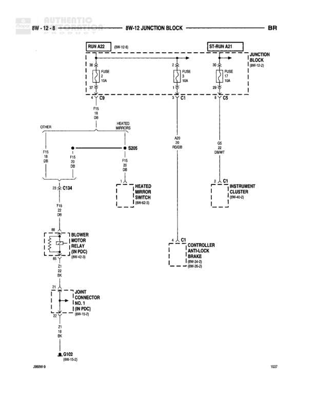

# AUTOMATIC - 8W-12 JUNCTION BLOCK

**Notes:** This diagram shows the automatic HVAC and related circuits from the junction block, including heated mirrors, blower motor relay, instrument cluster, and ABS controller connections. Page number 1037, document reference 288BW-9. BR designation appears at top right indicating this is part of a brake-related circuit section.

## Components

| Component | Ref | Connectors | Notes |
|-----------|-----|------------|-------|
| RUN A22 | 8W-12-6 |  | Junction at top of diagram |
| ST-RUN A21 |  |  | Junction leading to Junction Block |
| JUNCTION BLOCK | 8W-12-2 |  | Main junction block |
| HEATED MIRRORS |  |  | Heated mirror circuit |
| HEATER MIRROR SWITCH | 8W-43-0 | C1 | Switch for heated mirrors |
| INSTRUMENT CLUSTER | 8W-40-2 | C1 | Main instrument cluster |
| BLOWER MOTOR RELAY (IN PDC) | 8W-14-1 |  | Relay in Power Distribution Center |
| CONTROLLER ANTI-LOCK BRAKE | 8W-34-0, 8W-35-0 | C1 | ABS controller |
| JOINT CONNECTOR NO. 1 (IN PDC) | 8W-10-0 |  | Joint connector in Power Distribution Center |

## Wires

| From | To | Wire Code | Gauge | Color | Notes |
|------|-----|-----------|-------|-------|-------|
| RUN A22 Pin 30 | Fuse F16 | A22 | 10 | RD | FUSE 10A |
| RUN A22 Pin 30 | ST-RUN A21 Pin 30 | A22 | 10 | RD | FUSE 10A |
| ST-RUN A21 Pin 30 | Junction Block Pin 30 | A21 | 12 | VT | FUSE 10A |
| Fuse F16 DR | S205 | A20 | None | None | OTHER branch |
| Fuse F16 DR | Heated Mirrors | None | None | None |  |
| S205 | Fuse F16 DR | None | None | None |  |
| Fuse F16 DR | C134 | None | None | DB |  |
| C134 | Fuse F16 22 DB | None | 22 | DB |  |
| Fuse F16 22 DB | Blower Motor Relay Pin 85 | None | 22 | DB |  |
| Heated Mirrors | Heater Mirror Switch C1 | A20 | None | None |  |
| Junction Block Pin 30 | Instrument Cluster C1 | A21 | 22 | DK/WT |  |
| Junction Block Pin 30 | Controller Anti-Lock Brake C1 | A21 | None | None |  |
| Blower Motor Relay Pin 87 | Joint Connector No. 1 Pin 22 | Z1 | 18 | BK |  |
| Joint Connector No. 1 Pin 22 | G102 | Z1 | 18 | BK |  |

## Splices & Grounds

| ID | Type | Location | Wires Connected | Notes |
|----|------|----------|-----------------|-------|
| S205 | splice | Between heated mirrors and other circuits | A20 | Splits power feed to heated mirrors and other components |
| C134 | connector | Inline connector in circuit |  | Connection point before blower motor relay |
| G102 | ground | 8W-15-2 |  | Ground point for blower motor relay circuit |

## Cross-References

- 8W-12-6
- 8W-12-2
- 8W-43-0
- 8W-40-2
- 8W-14-1
- 8W-34-0
- 8W-35-0
- 8W-10-0
- 8W-15-2
