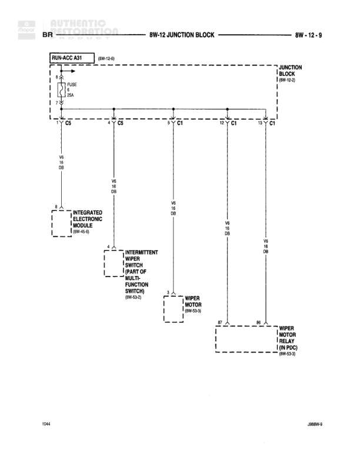

# 8W-12 JUNCTION BLOCK

**Notes:** This diagram shows the power distribution from the RUN/ACC A31 circuit through the junction block to various wiper system components. All V6 wires are 18 gauge Dark Green.

## Components

| Component | Ref | Connectors | Notes |
|-----------|-----|------------|-------|
| RUN/ACC A31 | 8W-12-9 | C2 | Contains FUSE 5 15A |
| INTEGRATED ELECTRONIC MODULE | 8W-10-8 |  |  |
| INTERMITTENT WIPER SWITCH (PART OF MULTI-FUNCTION SWITCH) | 8W-12-2 |  |  |
| WIPER MOTOR | 8W-12-3 |  |  |
| WIPER MOTOR RELAY (IN PDC) | 8W-12-3 |  |  |
| JUNCTION BLOCK | 8W-12-9 | C2, C8, C3, C1, C1 |  |

## Wires

| From | To | Wire Code | Gauge | Color | Notes |
|------|-----|-----------|-------|-------|-------|
| RUN/ACC A31 FUSE 5 | JUNCTION BLOCK C2 | F5 | 18 | DG |  |
| JUNCTION BLOCK C2 | JUNCTION BLOCK C8 | V6 | 18 | DG |  |
| JUNCTION BLOCK C8 | INTEGRATED ELECTRONIC MODULE | V6 | 18 | DG |  |
| JUNCTION BLOCK C8 | JUNCTION BLOCK C3 | V6 | 18 | DG |  |
| JUNCTION BLOCK C3 | INTERMITTENT WIPER SWITCH | V6 | 18 | DG |  |
| JUNCTION BLOCK C3 | JUNCTION BLOCK C1 | V6 | 18 | DG |  |
| JUNCTION BLOCK C1 | WIPER MOTOR | V6 | 18 | DG |  |
| JUNCTION BLOCK C1 | JUNCTION BLOCK C1 | V6 | 18 | DG |  |
| JUNCTION BLOCK C1 (rightmost) | WIPER MOTOR RELAY (IN PDC) | V6 | 18 | DG |  |
| WIPER MOTOR | WIPER MOTOR RELAY (IN PDC) | B7 | None |  |  |

## Cross-References

- 8W-12-9
- 8W-10-8
- 8W-12-2
- 8W-12-3
