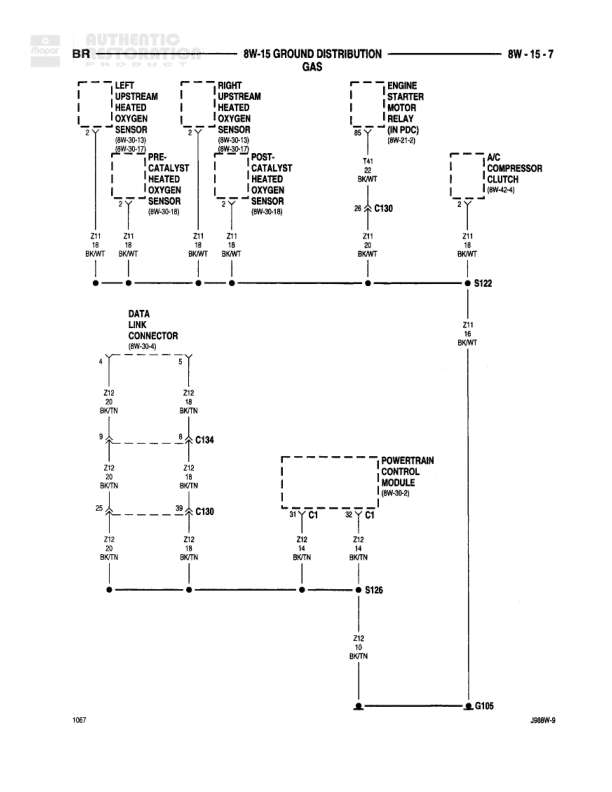

# Ground Distribution

**Notes:** This diagram shows the ground distribution network for interior lighting, accessories, and various control modules. Ground circuits Z2, Z3, and Z4 are used with different wire gauges depending on current requirements. The diagram is labeled as BR (possibly indicating a specific vehicle configuration).

## Components

| Component | Ref | Connectors | Notes |
|-----------|-----|------------|-------|
| Left Visor Vanity Lamp | 8W-44-2 |  | None |
| Day/Night Mirror (High-Line) | 8W-44-2 |  | None |
| Right Visor Vanity Lamp | 8W-44-2 |  | None |
| Overhead Console (High-Line) | 8W-44-4 |  | None |
| Overhead Map/Courtesy Lamps | 8W-44-6 |  | None |
| Glove Box Lamp | 8W-44-3 |  | None |
| Heated Mirror Switch | 8W-65-3 |  | None |
| Central Timer Module | 8W-45-2 |  | None |
| Fog Lamp Switch | 8W-55-6 |  | None |
| Junction Block | 8W-14-2 | C3 | None |
| Powertrain Control Module | 8W-53-2 | C7 | None |
| A/C Heater Control | 8W-45-2 |  | None |
| Cigar Lighter | 8W-41-3 |  | None |
| Electric Brake | 8W-56-3 |  | None |
| Ash Receiver Lamp | 8W-44-6 |  | None |
| Instrument Cluster | 8W-60-2 |  | None |
| Cup Holder Lamp | 8W-44-6 |  | None |
| Power Outlet | 8W-41-3 |  | None |
| Joint Connector No. 5 | None |  | None |

## Wires

| From | To | Wire Code | Gauge | Color | Notes |
|------|-----|-----------|-------|-------|-------|
| Left Visor Vanity Lamp | C352 | Z4 | 24 | BK | None |
| Day/Night Mirror | C352 | Z4 | 24 | BK | None |
| Right Visor Vanity Lamp | C353 | Z4 | 24 | BK | None |
| Overhead Console | C353 | Z4 | 24 | BK | None |
| Overhead Map/Courtesy Lamps | C352 | Z4 | 24 | BK | None |
| Overhead Map/Courtesy Lamps | C353 | Z4 | 24 | BK | None |
| C352 | S323 | Z4 | 24 | BK | None |
| C353 | S323 | Z4 | 24 | BK | None |
| S323 | Junction Connector No. 5 | Z4 | 24 | BK | None |
| Glove Box Lamp | Junction Connector No. 5 | Z4 | 24 | BK/OR | None |
| Heated Mirror Switch | Central Timer Module | Z2 | 20 | BK/OR | None |
| Central Timer Module | Junction Connector No. 5 | Z2 | 20 | BK/OR | None |
| Fog Lamp Switch | Junction Connector No. 5 | Z3 | 22 | BK/OR | None |
| Junction Block C3 | Powertrain Control Module C7 | Z1 | 12 | BK/WT | None |
| Powertrain Control Module C7 | Ground | Z3 | 22 | BK/WT | None |
| A/C Heater Control | C134 | Z3 | 22 | BK/OR | None |
| Cigar Lighter | Ground | Z3 | 22 | BK/OR | None |
| Electric Brake | Ground | Z3 | 22 | BK/OR | None |
| Ash Receiver Lamp | Junction Connector No. 5 | Z3 | 22 | BK/OR | None |
| Instrument Cluster | Ground | Z3 | 18 | BK/OR | None |
| Cup Holder Lamp | C134 | Z3 | 22 | BK/OR | None |
| Power Outlet | Ground | Z3 | 18 | BK/OR | None |
| C134 | G001 | Z3 | 22 | BK/OR | None |
| G001 | G200 | Z3 | 22 | BK/OR | None |

## Splices & Grounds

| ID | Type | Location | Wires Connected | Notes |
|----|------|----------|-----------------|-------|
| C352 | connector | Left side overhead area | Z4 | Connects left visor, day/night mirror, and overhead lamps |
| C353 | connector | Right side overhead area | Z4 | Connects right visor, overhead console, and overhead lamps |
| S323 | splice | Central overhead area | Z4 | Combines C352 and C353 grounds |
| C134 | connector | Central instrument panel area | Z3 | Ground distribution point |
| G001 | ground | Central instrument panel |  | Primary ground point |
| G200 | ground | 8W-15-6 |  | Secondary ground point |

## Cross-References

- 8W-44-2
- 8W-44-3
- 8W-44-4
- 8W-44-6
- 8W-45-2
- 8W-41-3
- 8W-53-2
- 8W-55-6
- 8W-56-3
- 8W-60-2
- 8W-65-3
- 8W-14-2
- 8W-15-6
