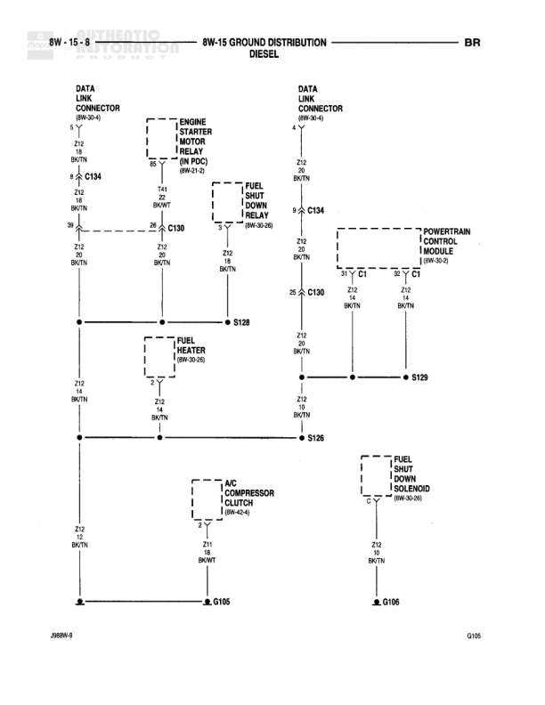

# GROUND DISTRIBUTION

**Notes:** This diagram shows ground distribution for door switches, power windows, power mirrors, seatbelt control module, and door limit switches. Multiple circuits connect through splices S329, S330, and S365 before connecting to main ground point G300. Some circuits are labeled as MIDLINE, HIGH-LINE, or EXCEPT BASE indicating equipment level variations.

## Components

| Component | Ref | Connectors | Notes |
|-----------|-----|------------|-------|
| LEFT DOOR JAMB SWITCH | 8W-6-2 |  |  |
| LEFT DOOR WINDOW SWITCH | 8W-62-2 |  |  |
| RIGHT POWER WINDOW MOTORS | 8W-62-3 |  |  |
| RIGHT DOOR DISARM SWITCH | 8W-6-2 |  |  |
| RIGHT DOOR WINDOW LOCK SWITCH |  |  |  |
| POWER MIRROR MOTORS | 8W-62-2 |  |  |
| LEFT DOOR DISARM SWITCH | 8W-6-2 |  |  |
| LEFT POWER MIRROR MOTORS | 8W-62-3 |  |  |
| SEATBELT CONTROL MODULE | 8W-33-1 |  |  |
| RIGHT DOOR LIMIT SWITCH | 8W-47-3 |  |  |

## Wires

| From | To | Wire Code | Gauge | Color | Notes |
|------|-----|-----------|-------|-------|-------|
| LEFT DOOR JAMB SWITCH | Z2 18 BK/LG node | Z2 | 18 | BK/LG |  |
| LEFT DOOR WINDOW SWITCH | Z2 18 BK/LG node | Z2 | 18 | BK/LG |  |
| POWER MIRROR MOTORS | Z2 20 BK/LG node | Z2 | 20 | BK/LG | MIDLINE |
| POWER MIRROR MOTORS | Z2 20 BK/LG node | Z2 | 20 | BK/LG | HIGH-LINE |
| RIGHT POWER WINDOW MOTORS | S330 | Z2 | 18 | BK/LG |  |
| RIGHT DOOR DISARM SWITCH | Z2 18 BK/LG node | Z2 | 18 | BK/LG |  |
| LEFT DOOR DISARM SWITCH | Z2 18 BK/LG node | Z2 | 18 | BK/LG |  |
| LEFT POWER MIRROR MOTORS | Z2 20 BK/LG node | Z2 | 20 | BK/LG | MIDLINE |
| S329 | C347 | Z2 | 18 | BK/LG |  |
| SEATBELT CONTROL MODULE | C360 | Z16 | 18 | BK/PK |  |
| RIGHT DOOR LIMIT SWITCH | S365 | Z2 | 18 | BK/LG |  |
| C347 | Z2 18 BK/LG horizontal bus | Z2 | 18 | BK/LG |  |
| C360 | Z16 18 BK/PK to G300 | Z16 | 18 | BK/PK |  |
| S365 | Z2 18 BK/LG horizontal bus | Z2 | 18 | BK/LG |  |
| S330 | C345 | Z2 | 18 | BK/LG | HIGH-LINE, 10 |
| C345 | S330 | Z2 | 18 | BK/LG | HIGH-LINE |
| horizontal bus | G300 | Z2 | 18 | BK/LG | multiple connection points |

## Splices & Grounds

| ID | Type | Location | Wires Connected | Notes |
|----|------|----------|-----------------|-------|
| S329 | splice | Left side, connects multiple door and mirror circuits | Z2 | EXCEPT BASE |
| S330 | splice | Right side, near right power window motors | Z2 |  |
| S365 | splice | Right side, near right door limit switch | Z2 |  |
| G300 | ground | Bottom center of diagram, main ground distribution point |  | Primary ground point for all circuits on this diagram |
| G301 | ground | Below G300, shown with ground symbol |  | 8W-15-42 |

## Cross-References

- 8W-6-2
- 8W-62-2
- 8W-62-3
- 8W-33-1
- 8W-47-3
- 8W-15-42
