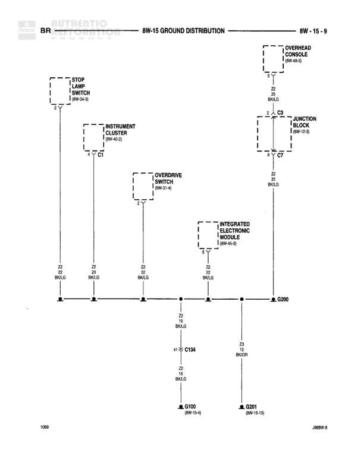

# 8W-15 GROUND DISTRIBUTION

**Notes:** This diagram shows the ground distribution network for various body and seat control systems. All circuits ultimately connect through splice S311 to ground G301. Wire colors are predominantly BK/LG (Black with Light Green tracer) and BK/OR (Black with Orange tracer) for ground circuits.

## Components

| Component | Ref | Connectors | Notes |
|-----------|-----|------------|-------|
| LEFT DOOR WINDOW SWITCH | 8W-60-3 |  |  |
| CENTER HIGH MOUNTED STOP LAMP NO. 1 | 8W-51-1 | C348 |  |
| CENTER HIGH MOUNTED STOP LAMP NO. 2 | 8W-51-3 | C308 |  |
| POWER SEAT SWITCH | 8W-67-1 |  |  |
| DRIVER SEAT SOLENOID | 8W-67-3 | C362, C363 |  |
| PASSENGER SEAT SOLENOID | 8W-67-3 |  |  |
| POWER SEAT SWITCH | 8W-68-2 | C360, C303 |  |

## Wires

| From | To | Wire Code | Gauge | Color | Notes |
|------|-----|-----------|-------|-------|-------|
| G300 (8W-12-1) | LEFT DOOR WINDOW SWITCH | Z2 | 20 | BK/LG |  |
| LEFT DOOR WINDOW SWITCH | Junction point | Z2 | 20 | BK/LG |  |
| Junction point | C348 | Z2 | 20 | BK/LG |  |
| C348 | CENTER HIGH MOUNTED STOP LAMP NO. 1 | None | None | None |  |
| Junction point | C308 | Z2 | 20 | BK/LG |  |
| C308 | CENTER HIGH MOUNTED STOP LAMP NO. 2 | Z2 | 20 | BK/OR |  |
| Junction point | Junction for seat circuits | Z2 | 20 | BK/LG |  |
| POWER SEAT SWITCH (8W-67-1) | Junction point | Z2 | 18 | BK/LG |  |
| DRIVER SEAT SOLENOID | C362 | Z2 | 16 | BK/LG |  |
| C362 | Junction point | None | None | None |  |
| DRIVER SEAT SOLENOID | C363 | Z2 | 16 | BK/LG |  |
| C363 | Junction point | None | None | None |  |
| Junction point | S328 | Z2 | 16 | BK/LG |  |
| PASSENGER SEAT SOLENOID | Junction point | Z2 | 16 | BK/LG |  |
| POWER SEAT SWITCH (8W-68-2) | Junction point | Z2 | 18 | BK/OR |  |
| Junction point | C360 | Z2 | 20 | BK/OR |  |
| C360 | CLUB CAB | None | None | None |  |
| Junction point | C303 | Z2 | 16 | BK/LG |  |
| C303 | OTHER | None | None | None |  |
| S328 and other junction points | S311 | Z2 | 16 | BK/LG |  |
| S311 | G301 | Z2 | 16 | BK/LG |  |

## Splices & Grounds

| ID | Type | Location | Wires Connected | Notes |
|----|------|----------|-----------------|-------|
| S328 | splice | Right side of diagram, connects driver and passenger seat circuits | Z2 |  |
| S311 | splice | Lower center of diagram, consolidates all ground paths | Z2 |  |
| G300 | ground | Top left, reference 8W-12-1 |  | Main ground source for this distribution |
| G301 | ground | Bottom center of diagram |  | Final ground point for all circuits |
| C348 | connector | Left side, connects to Center High Mounted Stop Lamp No. 1 | Z2 |  |
| C308 | connector | Left side, connects to Center High Mounted Stop Lamp No. 2 | Z2 |  |
| C362 | connector | Right side, connects to Driver Seat Solenoid | Z2 |  |
| C363 | connector | Right side, connects to Driver Seat Solenoid | Z2 |  |
| C360 | connector | Lower right, connects to Club Cab configuration | Z2 |  |
| C303 | connector | Lower right, connects to other circuits | Z2 |  |

## Cross-References

- 8W-12-1
- 8W-60-3
- 8W-51-1
- 8W-51-3
- 8W-67-1
- 8W-67-3
- 8W-68-2
