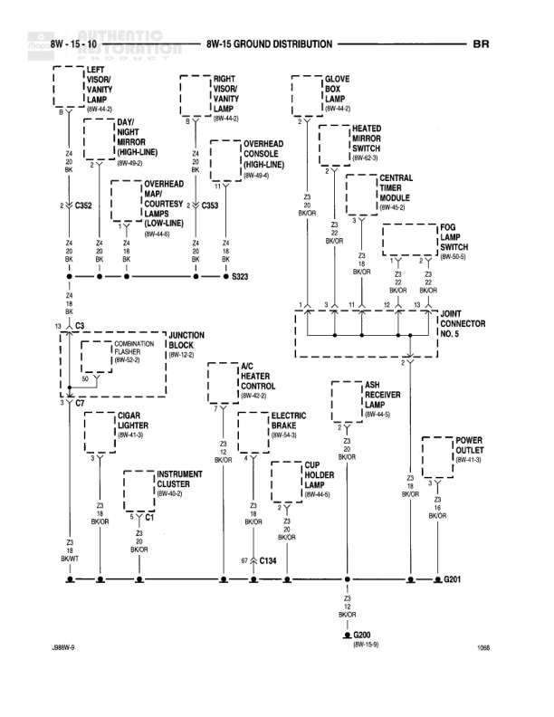

# GROUND DISTRIBUTION

**Notes:** This diagram shows the ground distribution for the identification and clearance lamps. All five lamps (left outboard clearance, left outboard identification, center identification, right outboard clearance, and right outboard identification) connect to splice S325 via Z4 18 BK wires, which then connects to ground G302.

## Components

| Component | Ref | Connectors | Notes |
|-----------|-----|------------|-------|
| LEFT OUTBOARD CLEARANCE LAMP | 8W-60-7 |  |  |
| LEFT OUTBOARD IDENTIFICATION LAMP | 8W-60-7 |  |  |
| CENTER IDENTIFICATION LAMP | 8W-60-7 |  |  |
| RIGHT OUTBOARD CLEARANCE LAMP | 8W-60-7 |  |  |
| RIGHT OUTBOARD IDENTIFICATION LAMP | 8W-60-7 |  |  |

## Wires

| From | To | Wire Code | Gauge | Color | Notes |
|------|-----|-----------|-------|-------|-------|
| LEFT OUTBOARD CLEARANCE LAMP | S325 | Z4 | 18 | BK |  |
| LEFT OUTBOARD IDENTIFICATION LAMP | S325 | Z4 | 18 | BK |  |
| CENTER IDENTIFICATION LAMP | S325 | Z4 | 18 | BK |  |
| RIGHT OUTBOARD CLEARANCE LAMP | S325 | Z4 | 18 | BK |  |
| RIGHT OUTBOARD IDENTIFICATION LAMP | S325 | Z4 | 18 | BK |  |
| S325 | G302 | Z4 | 18 | BK |  |

## Splices & Grounds

| ID | Type | Location | Wires Connected | Notes |
|----|------|----------|-----------------|-------|
| S325 | splice | Central junction point for all lamp grounds | Z4 | Connects all five lamp grounds to main ground |
| G302 | ground | Main ground point |  | Ground termination for identification and clearance lamps |

## Cross-References

- 8W-60-7
