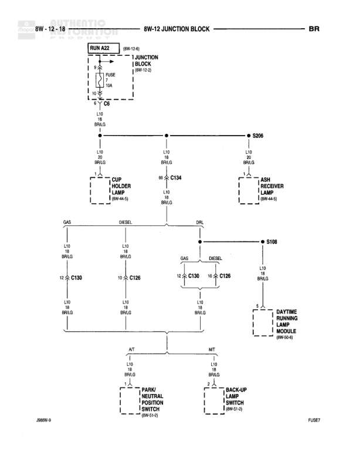

# GROUND DISTRIBUTION

**Notes:** This diagram shows the ground distribution network within the Power Distribution Center (PDC) and connections to various relays and modules. All grounds shown are Z1 18 BK wires connecting to Joint Connector No. 1 in the PDC, which then connects to ground points G100 and G102.

## Components

| Component | Ref | Connectors | Notes |
|-----------|-----|------------|-------|
| TRAILER TOW MODULE | 8W-54-2 |  | Located in Power Distribution Center |
| AUTOMATIC SHUTDOWN RELAY | 8W-30-5 |  | Located in Power Distribution Center |
| FUEL HEATER RELAY | 8W-30-26 |  | Located in Power Distribution Center |
| BLOWER MOTOR RELAY | 8W-42-3 |  | Located in Power Distribution Center |
| FOG LAMP RELAY, NO. 2 | 8W-50-6 |  | Located in Power Distribution Center |
| DAYTIME RUNNING LAMP MODULE | 8W-50-6 |  | None |
| 4X4 SWITCH | 8W-21-6 |  | None |
| JOINT CONNECTOR NO. 1 | IN PDC |  | Located in Power Distribution Center |

## Wires

| From | To | Wire Code | Gauge | Color | Notes |
|------|-----|-----------|-------|-------|-------|
| TRAILER TOW MODULE | JOINT CONNECTOR NO. 1 pin 33 | Z1 | 18 | BK | None |
| AUTOMATIC SHUTDOWN RELAY | JOINT CONNECTOR NO. 1 pin 21 | Z1 | 18 | BK | None |
| FUEL HEATER RELAY | JOINT CONNECTOR NO. 1 pin 50 | Z1 | 18 | BK | None |
| BLOWER MOTOR RELAY | JOINT CONNECTOR NO. 1 pin 36 | Z1 | 18 | BK | None |
| FOG LAMP RELAY, NO. 2 | JOINT CONNECTOR NO. 1 pin 27 | Z1 | 18 | BK | None |
| DAYTIME RUNNING LAMP MODULE | JOINT CONNECTOR NO. 1 pin 29 | Z1 | 18 | BK | None |
| 4X4 SWITCH | C106 | Z1 | 18 | BK | None |
| C106 | JOINT CONNECTOR NO. 1 pin 29 | Z1 | 18 | BK | None |
| JOINT CONNECTOR NO. 1 pin 36 | G100 | Z1 | 18 | BK | None |
| JOINT CONNECTOR NO. 1 pin 22 | G102 | Z1 | 18 | BK | None |

## Splices & Grounds

| ID | Type | Location | Wires Connected | Notes |
|----|------|----------|-----------------|-------|
| G100 | ground | 8W-15-6 |  | None |
| G102 | ground | None |  | None |

## Cross-References

- 8W-54-2
- 8W-30-5
- 8W-30-26
- 8W-42-3
- 8W-50-6
- 8W-21-6
- 8W-15-6
