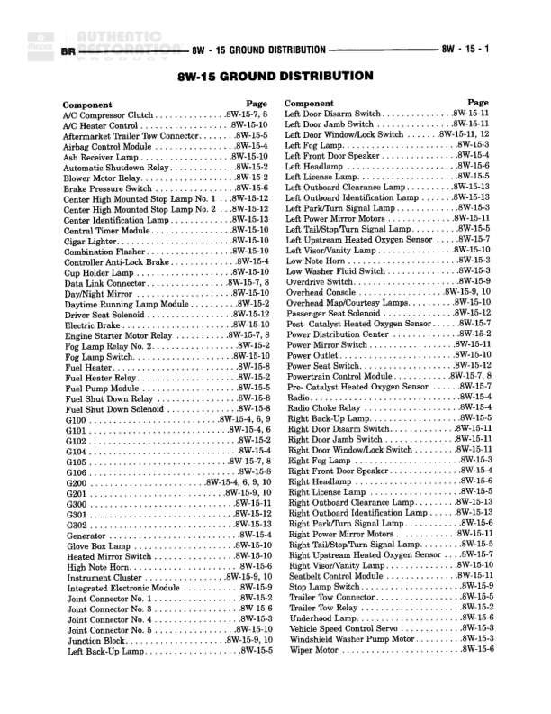

# GROUND DISTRIBUTION

**Notes:** This diagram shows the ground distribution for various front-end components including horns, washer systems, speed control, and lighting. All components ground through Joint Connector No. 4 which then grounds to G100. All wires are Z1 circuit (ground), Black color.

## Components

| Component | Ref | Connectors | Notes |
|-----------|-----|------------|-------|
| LOW NOTE HORN | 8W-41-0 |  |  |
| LOW WASHER FLUID SWITCH | 8W-60-0 |  |  |
| VEHICLE SPEED CONTROL SERVO | 8W-33-0 |  |  |
| WINDSHIELD WASHER PUMP MOTOR | 8W-53-0 |  |  |
| LEFT FRONT TURN SIGNAL LAMP | 8W-63-0 |  |  |
| LEFT FOG LAMP | 8W-59-0 |  |  |
| RIGHT FOG LAMP | 8W-59-0 |  |  |
| JOINT CONNECTOR NO. 4 |  | C106 |  |

## Wires

| From | To | Wire Code | Gauge | Color | Notes |
|------|-----|-----------|-------|-------|-------|
| LOW NOTE HORN | JOINT CONNECTOR NO. 4 | Z1 | 18 | BK |  |
| LOW WASHER FLUID SWITCH | JOINT CONNECTOR NO. 4 | Z1 | 18 | BK |  |
| VEHICLE SPEED CONTROL SERVO | JOINT CONNECTOR NO. 4 | Z1 | 20 | BK |  |
| WINDSHIELD WASHER PUMP MOTOR | JOINT CONNECTOR NO. 4 | Z1 | 20 | BK |  |
| LEFT FRONT TURN SIGNAL LAMP | JOINT CONNECTOR NO. 4 | Z1 | 18 | BK |  |
| LEFT FOG LAMP | C106 | Z1 | 20 | BK |  |
| C106 | JOINT CONNECTOR NO. 4 | Z1 | 20 | BK |  |
| RIGHT FOG LAMP | JOINT CONNECTOR NO. 4 | Z1 | 20 | BK |  |
| JOINT CONNECTOR NO. 4 | G100 | Z1 | 12 | BK |  |

## Splices & Grounds

| ID | Type | Location | Wires Connected | Notes |
|----|------|----------|-----------------|-------|
| C106 | connector | Between left and right fog lamps | Z1 |  |
| G100 | ground | 8W-15-0 |  | Main ground point for this distribution |

## Cross-References

- 8W-41-0
- 8W-60-0
- 8W-33-0
- 8W-53-0
- 8W-63-0
- 8W-59-0
- 8W-15-0
