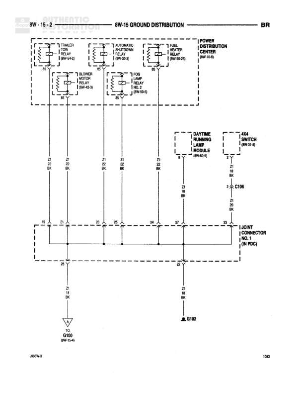

# GROUND DISTRIBUTION

**Notes:** This diagram shows the ground distribution system (BR circuit) including grounds for audio components (premium speakers, radio), generator, airbag control module, and anti-lock brake controller. Main ground bus G100 distributes to multiple ground points.

## Components

| Component | Ref | Connectors | Notes |
|-----------|-----|------------|-------|
| LEFT FRONT DOOR SPEAKER (PREMIUM) | 8W-47-6 | C347 | Premium audio system |
| RIGHT FRONT DOOR SPEAKER (PREMIUM) | 8W-47-6 | C346 | Premium audio system |
| GENERATOR | 8W-30-3 |  | None |
| RADIO | 8W-47-6 |  | None |
| RADIO CHOKE RELAY | 8W-47-6 | C203 | None |
| AIRBAG CONTROL MODULE | 8W-43-2 |  | None |
| CONTROLLER ANTI-LOCK BRAKE | 8W-30-3 |  | None |
| CENTER JOINT CONNECTOR NO. 1 (IN PDC) | 8W-15-2 | C134 | In Power Distribution Center |
| FROM JOINT CONNECTOR NO. 4 | 8W-15-8 |  | None |

## Wires

| From | To | Wire Code | Gauge | Color | Notes |
|------|-----|-----------|-------|-------|-------|
| LEFT FRONT DOOR SPEAKER (PREMIUM) | C347 | Z8 | 20 | BK/WT | None |
| C347 | S302 | Z8 | 20 | BK/WT | None |
| RIGHT FRONT DOOR SPEAKER (PREMIUM) | C346 | Z8 | 20 | BK/WT | None |
| C346 | S302 | Z8 | 20 | BK/WT | None |
| GENERATOR | G104 | Z1 | 8 | BK | None |
| RADIO | S204 | Z5 | 18 | BK/OR | None |
| RADIO CHOKE RELAY | C203 | Z8 | 20 | BK/WT | None |
| C203 | S204 | Z8 | 20 | BK/WT | None |
| S302 | Horizontal ground bus | Z8 | 20 | BK/WT | None |
| S204 | C134 | Z5 | 18 | BK/OR | None |
| S204 | Horizontal ground bus | Z8 | 20 | BK/WT | None |
| AIRBAG CONTROL MODULE | C134 | Z8 | 20 | BK/PK | None |
| C134 | Horizontal ground bus | Z8 | 18 | BK/PK | None |
| FROM JOINT CONNECTOR NO. 4 | Horizontal ground bus | Z1 | 12 | BK | None |
| Horizontal ground bus | G100 | Z1 | 12 | BK | Multiple connection points |
| Horizontal ground bus | CONTROLLER ANTI-LOCK BRAKE | Z8 | 20 | BK/WT | None |
| CONTROLLER ANTI-LOCK BRAKE | S112 | Z8 | 20 | BK/WT | None |
| S112 | G101 | Z1 | 12 | BK | None |
| C134 | G200 | Z2 | 14 | BK/LG | None |

## Splices & Grounds

| ID | Type | Location | Wires Connected | Notes |
|----|------|----------|-----------------|-------|
| S302 | splice | Upper left area, connects speaker grounds | Z8 | Connects left and right front speaker grounds |
| S204 | splice | Center area, connects radio grounds | Z5, Z8 | Connects radio and radio choke relay grounds |
| S112 | splice | Lower left area | Z8, Z1 | Connects anti-lock brake controller to ground |
| G104 | ground | Upper right area |  | Generator ground point |
| G100 | ground | Center horizontal bus |  | Main ground distribution bus |
| G101 | ground | Lower left area |  | Anti-lock brake controller ground |
| G200 | ground | Lower right area |  | Joint connector ground, connects to C134 |

## Cross-References

- 8W-47-6
- 8W-30-3
- 8W-43-2
- 8W-15-2
- 8W-15-8
