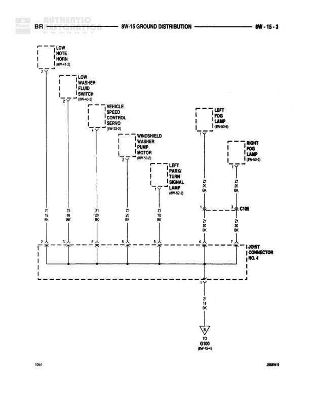

# GROUND DISTRIBUTION

**Notes:** Ground distribution diagram for rear lighting system including backup lamps, tail/stop/turn signal lamps, license lamps, trailer tow connectors, and fuel pump module. All grounds converge at G120.

## Components

| Component | Ref | Connectors | Notes |
|-----------|-----|------------|-------|
| LEFT BACK-UP LAMP | 8W-11-3 |  |  |
| RIGHT BACK-UP LAMP | 8W-11-3 |  |  |
| LEFT TAIL/STOP/TURN SIGNAL LAMP | 8W-11-4 |  |  |
| RIGHT TAIL/STOP/TURN SIGNAL LAMP | 8W-11-4 |  |  |
| AFTERMARKET TRAILER TOW CONNECTOR | 8W-64-4 |  |  |
| TRAILER TOW CONNECTOR | 8W-64-4 |  |  |
| LEFT LICENSE LAMP | 8W-51-4 |  |  |
| RIGHT LICENSE LAMP | 8W-51-4 |  |  |
| FUEL PUMP MODULE | 8W-30-8 |  |  |

## Wires

| From | To | Wire Code | Gauge | Color | Notes |
|------|-----|-----------|-------|-------|-------|
| LEFT BACK-UP LAMP | S401 | Z13 | 20 | BK |  |
| RIGHT BACK-UP LAMP | S402 | Z13 | 20 | BK |  |
| LEFT TAIL/STOP/TURN SIGNAL LAMP | S401 | Z13 | 20 | BK |  |
| RIGHT TAIL/STOP/TURN SIGNAL LAMP | S402 | Z13 | 20 | BK |  |
| S401 | C333 | Z13 | 20 | BK |  |
| S402 | C329 | Z13 | 20 | BK |  |
| C333 | S315 | Z13 | 20 | BK |  |
| C329 | S315 | Z13 | 20 | BK |  |
| AFTERMARKET TRAILER TOW CONNECTOR | S315 | Z13 | 20 | BK |  |
| TRAILER TOW CONNECTOR | S315 | Z13 | 18 | BK |  |
| LEFT LICENSE LAMP | S315 | Z13 | 20 | BK |  |
| RIGHT LICENSE LAMP | S315 | Z13 | 20 | BK |  |
| S315 | S331 | Z13 | 20 | BK |  |
| FUEL PUMP MODULE | S331 | Z13 | 20 | BK |  |
| S331 | G120 | Z13 | 12 | BK |  |

## Splices & Grounds

| ID | Type | Location | Wires Connected | Notes |
|----|------|----------|-----------------|-------|
| S401 | splice | Left rear area | Z13 | Connects left backup and tail/stop/turn lamps |
| S402 | splice | Right rear area | Z13 | Connects right backup and tail/stop/turn lamps |
| C333 | connector | Left side connection point | Z13 |  |
| C329 | connector | Right side connection point | Z13 |  |
| S315 | splice | Central rear area | Z13 | Main distribution point for rear lighting grounds |
| S331 | splice | Near fuel pump module | Z13 | Connects to main ground point |
| G120 | ground | 8W-15-6 |  | Main ground point for rear lighting distribution |

## Cross-References

- 8W-11-3
- 8W-11-4
- 8W-64-4
- 8W-51-4
- 8W-30-8
- 8W-15-6
