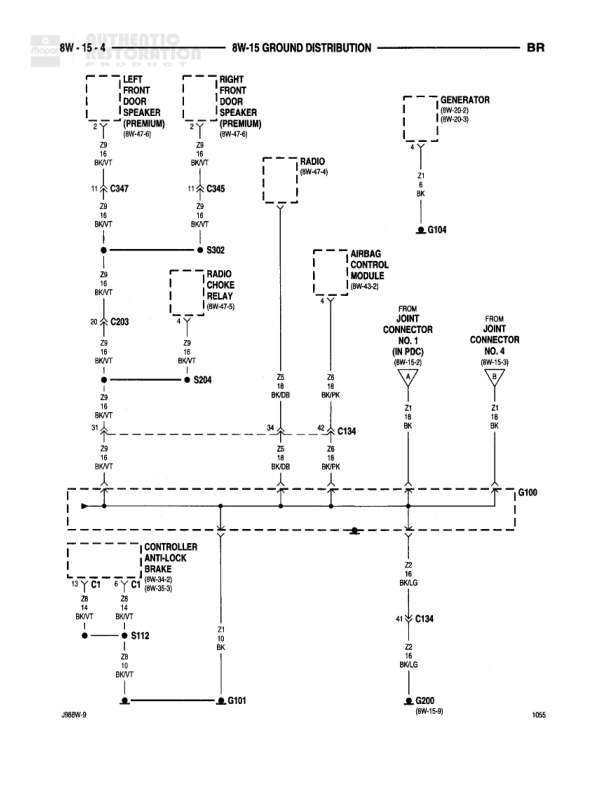

# 8W-15 GROUND DISTRIBUTION

**Notes:** This diagram shows the ground distribution system for various front-end components including lighting, horn, wiper motor, and brake pressure switch. Ground circuit Z13 feeds through connector C128 to distribute Z1 grounds to multiple components. The system connects to main grounds G100, G101, and G200.

## Components

| Component | Ref | Connectors | Notes |
|-----------|-----|------------|-------|
| Left Headlamp | 8W-20-3 |  | None |
| Right Headlamp | 8W-20-3 |  | None |
| Right Park/Turn Signal Lamp | 8W-83-3 |  | None |
| High Note Horn | 8W-41-2 |  | None |
| Brake Pressure Switch | 8W-40-3 |  | None |
| Wiper Motor | 8W-63-3 |  | None |
| Underhood Lamp | 8W-81-2 |  | None |
| Joint Connector No. 3 | None |  | None |
| Connector C128 | None | C128 | None |
| Connector C134 | None | C134 | None |

## Wires

| From | To | Wire Code | Gauge | Color | Notes |
|------|-----|-----------|-------|-------|-------|
| S331 (8W-15-0) | Splice point | Z13 | 12 | BK | None |
| Splice point | C128 | Z13 | 12 | BK | None |
| C128 | Horizontal distribution | Z13 | 12 | BK | None |
| Horizontal distribution | Left Headlamp | Z1 | 20 | BK | None |
| Horizontal distribution | Right Headlamp | Z1 | 20 | BK | None |
| Horizontal distribution | Right Park/Turn Signal Lamp | Z1 | 18 | BK | None |
| Horizontal distribution | High Note Horn | Z1 | 18 | BK | None |
| Horizontal distribution | Wiper Motor | Z1 | 20 | BK | None |
| Horizontal distribution | Brake Pressure Switch | Z1 | 20 | BK | None |
| Horizontal distribution | Underhood Lamp | Z1 | 20 | BK | None |
| Horizontal distribution | G100 | Z1 | 20 | BK | None |
| Joint Connector No. 3 | Horizontal distribution | Z1 | None | BK | Multiple connections |
| Horizontal distribution | C134 | Z1 | 20 | BK | None |
| C134 | G101 (8W-15-4) | Z1 | 10 | BK | None |
| C134 | G200 (8W-15-9) | Z1 | 12 | BK/LG | None |

## Splices & Grounds

| ID | Type | Location | Wires Connected | Notes |
|----|------|----------|-----------------|-------|
| G100 | ground | Underhood area |  | None |
| G101 | ground | Referenced on 8W-15-4 |  | None |
| G200 | ground | Referenced on 8W-15-9 |  | None |

## Cross-References

- 8W-15-0
- 8W-20-3
- 8W-83-3
- 8W-41-2
- 8W-40-3
- 8W-63-3
- 8W-81-2
- 8W-15-4
- 8W-15-9
